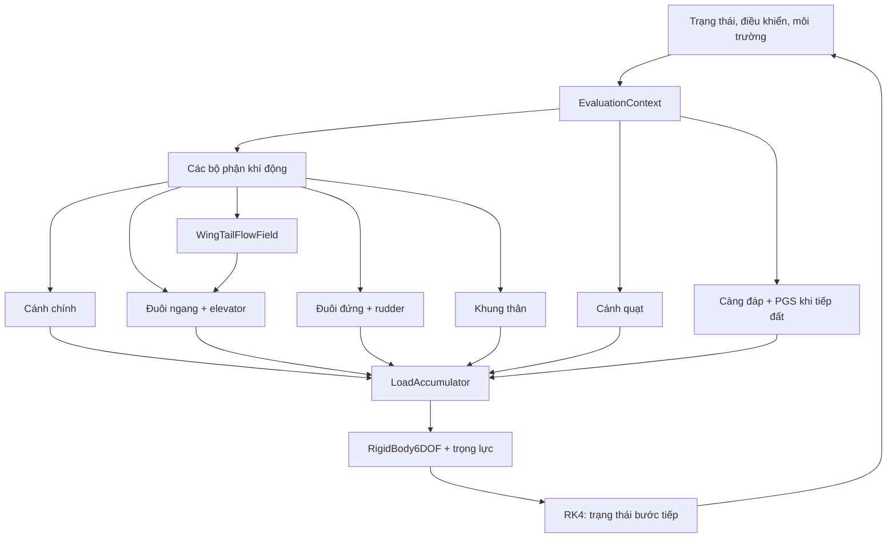

# Nội dung đề xuất thay thế mục 1.5.2 - Nhiệm vụ 02

**Phạm vi đối chiếu:** bản thảo `nhiệm vụ 2.pdf`, trang 18-19; mã nguồn nhánh
`calibration/t6c-datcom-fdr-v1`, commit `024ffa6` (24-09-2026). Đây là bản
nội dung để đưa vào báo cáo, không thay đổi tệp PDF gốc. Nếu phần báo cáo chính
dùng số mục 2 thay cho 1.5.2, hãy đổi số mục đồng loạt khi dàn trang.

## 1.5.2 NHIỆM VỤ 02: Xây dựng kiến trúc và mã nguồn mô phỏng động lực học máy bay huấn luyện

### 1.5.2.1 Yêu cầu nhiệm vụ

Xây dựng mô hình động lực học phi tuyến sáu bậc tự do (6-DOF) của máy bay huấn
luyện cánh quạt, trong đó tải của cánh chính, đuôi ngang, đuôi đứng, khung
thân, cánh quạt và càng đáp được tính trong các mô-đun riêng. Mỗi tải khí động
và lực đẩy được biểu diễn bằng lực trong hệ trục gắn thân và mô-men quy về
trọng tâm. Các tải được đưa vào phương trình Newton-Euler để xác định đạo hàm
trạng thái, sau đó được tích phân theo thời gian. Ngoài kiến trúc mô phỏng,
nhiệm vụ bao gồm chuẩn bị hình học và hệ số khí động ban đầu cho T-6C dựa trên
bản vẽ PC-9M và các quan hệ bán thực nghiệm, rồi đối chiếu kết quả với dữ liệu
thiết bị ghi tham số bay (FDR).

### 1.5.2.2 Thực trạng đầu vào và phạm vi dữ liệu

Mã nguồn gốc được tổ chức trên cấu hình tham chiếu Navion; hình học, đặc tính
cánh quạt, khối lượng tức thời, trọng tâm và mô-men quán tính ứng với từng
chuyến bay T-6C chưa có đủ số liệu xác nhận. Nhánh hiệu chỉnh đã tách cấu hình
T-6C/PC-9M và lưu nguồn gốc của các seed sơ bộ cho cánh chính, đuôi ngang có
downwash, khung thân và cánh quạt. Các seed này là điểm bắt đầu để hiệu chỉnh,
không phải bộ hệ số khí động T-6C đã được đo đầy đủ. Factory seed DATCOM dành
riêng cho đuôi đứng hiện chưa hoàn thành; phép thử trim dọc sử dụng drag proxy
được khóa cố định cho bộ phận này. Cấu hình T-6C toàn máy bay cũng chưa đủ
khối lượng bay, quán tính và một số hình học để coi là mô hình bay đã xác nhận.

Dữ liệu FDR cung cấp vận tốc, tư thế, một số vị trí mặt lái và trạng thái vận
hành để chọn đoạn bay, lập điều kiện đầu và kiểm tra đầu ra. Tệp được dùng
cho ví dụ hiệu chỉnh trim không có kênh đo net thrust; kênh vị trí elevator
`ELEVPOS1` không ghi đơn vị trong header. Do đó các kết quả khớp trim phải
được trình bày kèm giả thiết chuyển đổi đơn vị và khối lượng.

### 1.5.2.3 Mục tiêu và tiêu chí đánh giá

1. Thiết lập giao diện chung, quy ước hệ trục và kiến trúc tích hợp sáu bộ
   phận, khối tổng hợp tải, vật rắn 6-DOF và bộ tích phân RK4.
2. Khởi tạo các hệ số khí động và tải cánh quạt sơ bộ cho cấu hình T-6C/PC-9M;
   tách rõ dữ liệu bản vẽ, giá trị công bố, giả thiết và kết quả tính.
3. Chuẩn hóa dữ liệu FDR, xác định các trường hợp có thể so sánh và tính sai
   lệch theo từng đại lượng. Với bài 2.c.5 Longitudinal trim, đối chiếu góc
   elevator, góc pitch và góc pitch trim theo đúng dung sai góc nêu trong
   CS-FSTD Issue 1; xác định lực đẩy cân bằng nếu không có số đo lực đẩy.
4. Đánh giá mức độ tin cậy của từng kết quả và chỉ coi mô hình T-6C đạt yêu
   cầu sau khi có đủ dữ liệu điều kiện bay, tham số khối lượng, ánh xạ mặt lái
   và các trường hợp kiểm định độc lập.

**Lưu ý về chỉ tiêu trong bản nháp:** mốc sai số `<= 10%` có thể giữ như mục
tiêu nghiên cứu nội bộ cho những đại lượng phù hợp, nhưng không thay thế các
dung sai `±1°` elevator, `±0,5°` pitch trim và `±1°` pitch của 2.c.5. Không
ghi “đạt 2.c.5” khi còn thiếu góc pitch trim hợp lệ và điểm kiểm định độc lập.

### 1.5.2.4 Phương pháp và kiến trúc mô phỏng

Các mô-đun khí động và cánh quạt triển khai giao diện `ILoadComponent`: nhận
`EvaluationContext` gồm trạng thái vật rắn, lệnh điều khiển, môi trường, điều
kiện bay và tham số khối lượng; trả `BodyLoad` gồm lực `F_B` [N] và mô-men
`M_CG,B` [N.m] trong hệ body **FRD** (x hướng mũi, y hướng cánh phải, z hướng
xuống), quy về CG. Mô-men do một lực tại bộ phận được chuyển về CG bằng
`M_CG = M_tại_điểm + r_CG->điểm × F`; khối tổng hợp tải không nhân thêm cánh
tay đòn lần thứ hai. Trọng lực được cộng trong `RigidBody6DOF` một lần.

| Bộ phận / mô-đun | Input đặc thù ngoài context chung | Output trong mã nguồn | Vai trò và phạm vi hiện tại |
|---|---|---|---|
| Cánh chính (`VATC_MainWing`) | S, MAC, incidence, các hệ số `CL`, `CD`, `Cm`; góc tấn, vận tốc, tốc độ góc; lệnh flap và aileron | `BodyLoad(F_B, M_CG,B)`; chẩn đoán lift/drag/moment, gia số flap và hệ số lateral | Flap tác động khí động dọc; aileron theo các đạo hàm tuyến tính lateral; seed hình học/khí động T-6C sơ bộ |
| Đuôi ngang + elevator (`HorizontalStabilizer`) | Sải, diện tích, MAC, incidence, vị trí so với CG; elevator; trường vận tốc cục bộ từ `WingTailFlowField` | `BodyLoad`; lift, drag, mô-men pitch, góc tấn cục bộ | Downwash và hệ số áp suất động được đưa vào dòng khí tại đuôi; seed PC-9M/T-6C sơ bộ |
| Đuôi đứng + rudder (`VerticalStabilizer`) | Diện tích/vị trí fin, góc trượt cạnh, rudder, các hệ số side force, yaw và drag | `BodyLoad`; side force, drag, yaw/roll moment tương ứng | Lớp mô hình đã có; **chưa có factory seed riêng T-6C**; ở trim đối xứng chủ yếu còn drag proxy |
| Khung thân (`DatcomFuselageComponent`) | Hình học tương đương, diện tích ướt, hệ số dạng, Re/Mach, α và các đạo hàm lực pháp tuyến/mô-men pitch | `BodyLoad`; drag, normal force, pitch moment quanh CG | Seed thân theo quan hệ DATCOM và các giả thiết hình học PC-9M |
| Cánh quạt (`PropellerComponent`) | Hình học blade, polar giả định, vận tốc dòng tới, mật độ, tốc độ quay, trạng thái kích hoạt | `BodyLoad`; thrust, torque và các thành phần mô-men tại hub/CG | BEMT tính tải; thông số hình học/polar proprietary được thay bằng proxy, chưa có governor/collective điều khiển công suất hoàn chỉnh |
| Càng đáp (`LandingGearComponent`) | Vị trí điểm tiếp xúc, nén lò xo, vận tốc bánh, phanh, lái mũi, bước thời gian `dt`, trạng thái weight-on-wheels | Tải pháp tuyến, ma sát và chẩn đoán từng bánh qua `IGroundContactComponent` | Ma sát PGS cần tổng tải trước ma sát nên dùng đường ghép riêng; **không** tham gia trim khi máy bay bay và thu càng |

*Bảng 1. Giao diện tính tải. Các đầu ra lực và mô-men của năm bộ phận bay
được quy về cùng hệ body/CG; càng đáp có thêm bước giải lực tiếp xúc.*

Sơ đồ sau nên đặt ngay sau Bảng 1. Mũi tên từ `WingTailFlowField` sang đuôi
ngang biểu diễn **hiệu chỉnh dòng khí cục bộ**, không phải cộng thêm một tải
khí động. Càng đáp chỉ được ghép vào khi có cấu hình tiếp đất.

*Hình 1. Luồng dữ liệu của mô hình 6-DOF. `TrainerAircraftModel` tạo context,
gọi các component và điều phối tổng tải; RK4 đánh giá tải theo trạng thái ở
từng bước con. Với bài trim bay bằng, nhánh càng đáp được bỏ qua.*

Để đối chiếu dữ liệu bay, dữ liệu FDR được lọc theo cấu hình (flap, càng, tình
trạng trên không), lấy thống kê tại cửa sổ lựa chọn rồi cấp vận tốc/môi trường
cho mô hình. Phép tối ưu trim giải các phương trình cân bằng lực dọc, lực đứng
và mô-men pitch bằng `scipy.optimize.least_squares`; sau đó so góc trim dự báo
với góc FDR. Hệ số chỉ được thay đổi trong một tập nhỏ vì một điểm bay đơn lẻ
không nhận dạng được đồng thời toàn bộ đạo hàm của sáu bộ phận.

### 1.5.2.5 Kết quả đạt được tính đến commit 024ffa6

Đã hoàn thành khung mã nguồn C++ có các lớp bộ phận tính tải, bộ tổng hợp tải,
khối vật rắn Newton-Euler, mô hình tiếp xúc mặt đất và bộ tích phân RK4. Mô
hình có thể báo cáo tải từng bộ phận để kiểm tra quy ước lực/mô-men và đã có
các bài kiểm thử cho các component. Các factory seed sơ bộ cho cánh chính, đuôi
ngang có downwash, fuselage và propeller đã được bổ sung trên nhánh T-6C;
các kết quả này phục vụ khảo sát và hiệu chỉnh tiếp theo.

Ở một ví dụ hiệu chỉnh trim dọc, bộ giải chọn 66 mẫu FDR tại Relative
13962-14027 s, sử dụng TAS trung bình **87,982 m/s**, pitch trung bình
**1,636°**, tín hiệu elevator trung bình **-0,676** (giả sử là độ), NP khoảng
**100,202%**. Tại khối lượng giả định **2.800 kg** và mật độ proxy
**1,10681 kg/m³**, ba tham số được điều chỉnh: wing `CL0` từ **0,202879** lên
**0,254202** (+25,30%), wing `Cm0` từ **-0,062220** xuống **-0,138853**
(+123,16% về trị số) và hệ số nhân tải propeller từ **1,000** xuống
**0,287937** (-71,21%). Các seed đuôi ngang, downwash và fuselage giữ nguyên;
fin drag proxy cũng được khóa cố định.

| Đại lượng tại điểm trim | Tham chiếu FDR | Trước tối ưu | Sau tối ưu | Có thể kết luận? |
|---|---:|---:|---:|---|
| Góc elevator | -0,676* | +1,747° | -0,676°* | Khớp số dùng tối ưu; chưa xác minh đơn vị/dấu |
| Góc pitch | +1,636° | +1,982° | +1,636° | Khớp trên chính điểm dùng tối ưu |
| Góc pitch trim | `ELETRIM = -2,308` (đơn vị chưa rõ) | Chưa tính | Chưa tính | Chưa thể đánh giá dung sai ±0,5° |
| Net thrust | FDR không đo | 1.639 N suy ra | 1.708 N suy ra | Chỉ là lực đẩy để cân bằng mô hình |

*Bảng 2. Kết quả minh họa của phép khớp trim dọc. Dấu * chỉ giá trị elevator
được giả sử có đơn vị độ. Ở cột “Trước tối ưu”, lực đẩy đã được giải như một
biến trim (scale khoảng 0,276), dù seed scale ban đầu là 1,000. Đây là kết quả
khớp trong tập hiệu chỉnh, chưa phải sai số trên bộ kiểm định độc lập.*

Các con số trong Bảng 2 cho thấy thuật toán và giao diện ghép C++/Python có
thể tìm nghiệm cân bằng ở điều kiện giả định. Chúng **không xác nhận** các hệ
số sau tối ưu là đặc tính khí động thực của riêng cánh hoặc cánh quạt: sai số
khối lượng/CG, downwash, ánh xạ elevator và bản đồ điều khiển động cơ cũng có
thể bị hấp thụ vào ba tham số. Chưa đưa các số hậu tối ưu vào factory seed bay.

### 1.5.2.6 So sánh với mục tiêu ban đầu

Kiến trúc sáu bộ phận, giao diện tải, khả năng tính lực-mô-men 6-DOF và một
quy trình hiệu chỉnh thử nghiệm đã được triển khai. Mục tiêu đối chiếu định
lượng cho cấu hình T-6C chỉ mới có **ví dụ khớp một điểm trim** trên các giả
thiết nêu trên. Chưa xác nhận mô hình đạt bài 2.c.5 CS-FSTD, vì góc pitch trim
chưa được ánh xạ, đơn vị/dấu elevator chưa chốt, khối lượng chuyến bay và lực
đẩy thực thiếu, đoạn FDR có tốc độ lên cao trung bình khác 0, và chưa có các
điểm cruise/approach/landing dùng để kiểm định độc lập. Các dung sai chuẩn
không thể được thay bằng kết luận “sai số dưới 10%” cho toàn mô hình.

### 1.5.2.7 Đánh giá mức độ hoàn thành và hướng tiếp theo

**Đã hoàn thành về khung phần mềm và khả năng tạo nghiệm hiệu chỉnh có điều
kiện; chưa hoàn thành về xác nhận độ chính xác T-6C.** Công việc tiếp theo là
xác nhận khối lượng, CG và quán tính theo chuyến bay; hoàn thiện seed đuôi
đứng; xác định đơn vị và truyền động của elevator/pitch trim; bổ sung mô hình
governor, blade pitch và quan hệ power-thrust; thu thập nhiều điểm trim độc lập
và tái chạy các bài thử bay khác. Khi các dữ liệu này đủ tin cậy, lập bảng sai
số theo từng đại lượng và từng trường hợp, đối chiếu chính thức với CS-FSTD.

## Gợi ý dàn trang và chú thích

- Giữ phần 1.5.2.1-1.5.2.3 như bối cảnh, mục tiêu; đặt **Bảng 1 và Hình 1**
  trong mục phương pháp ngay trước phần giải thích RK4/PGS.
- Trong mục kết quả, dùng **Bảng 2** và thêm một hình biểu diễn ba điểm
  *FDR - trước tối ưu - sau tối ưu* cho hai góc. Không vẽ biểu đồ sai số thrust
  so với FDR vì không có số đo thrust; có thể trình bày thrust suy ra ở bảng.
- Chú thích dưới bảng/hình phải ghi rõ “PC-9M proxy”, khối lượng giả định,
  đơn vị elevator chưa xác minh, điểm khớp là **training snapshot**. Nếu báo
  cáo dùng màu, dùng cùng một màu cho “FDR”, “trước” và “sau” trên mọi hình.
- Giữ mục đánh giá kết quả riêng khỏi mục mô tả kiến trúc, để người đọc không
  hiểu nhầm “mã chạy được” là “mô hình T-6C đã được xác nhận”.

**Nguồn kiểm tra:** nhánh mã nguồn [Trainer-Aircraft-6DOF-Nonlinear-Model tại
commit 024ffa6](https://github.com/huynguyen2909/Trainer-Aircraft-6DOF-Nonlinear-Model/tree/024ffa61501cba83cecabca79b293b35090fca06);
`docs/ARCHITECTURE.md`, `docs/T6C_LONGITUDINAL_TRIM_FDR_PROVISIONAL.md` và
`calibration_results/t6c_longitudinal_trim_provisional.json` trong commit đó;
*CS-FSTD Issue 1* (2026), bảng 2.c.5, trang 376, và yêu cầu thử ở trang 382
của tệp PDF kèm bản thảo.
