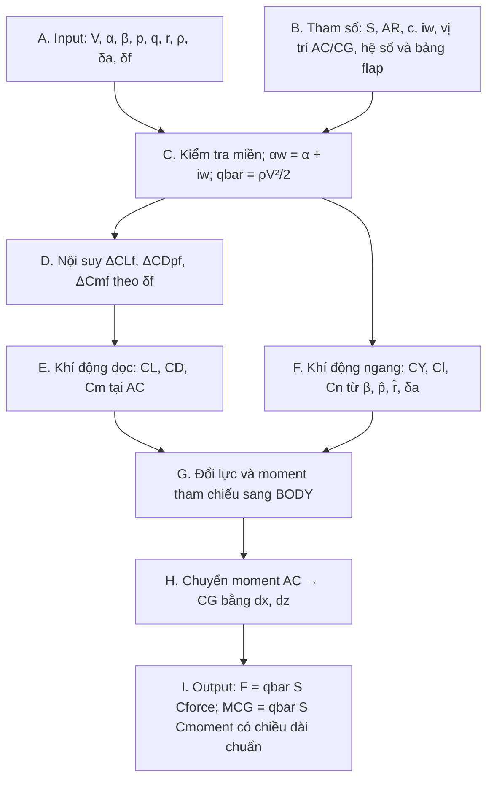
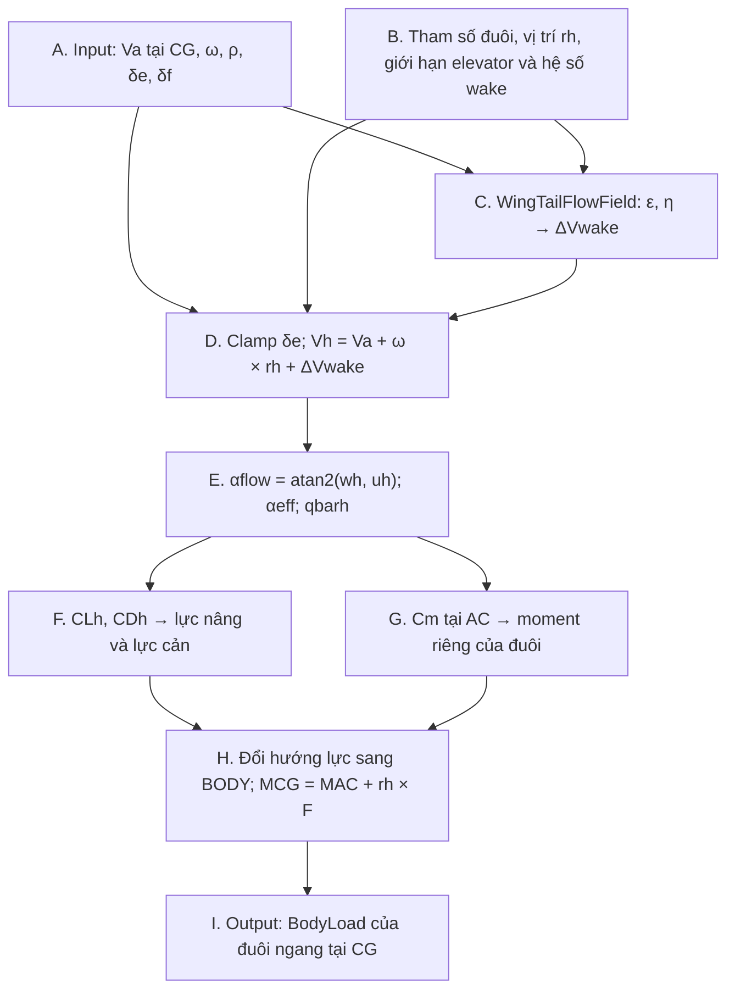
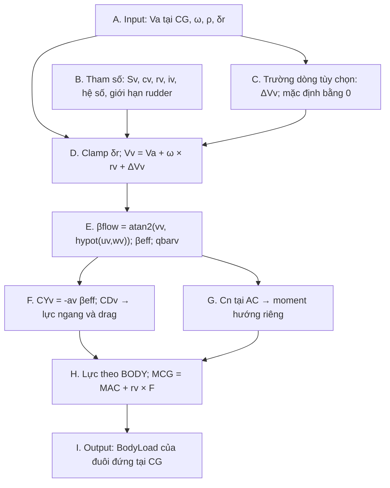
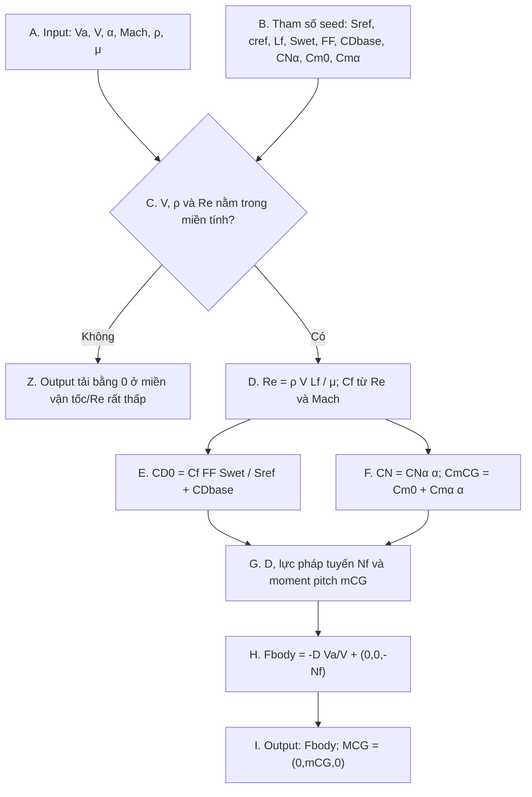
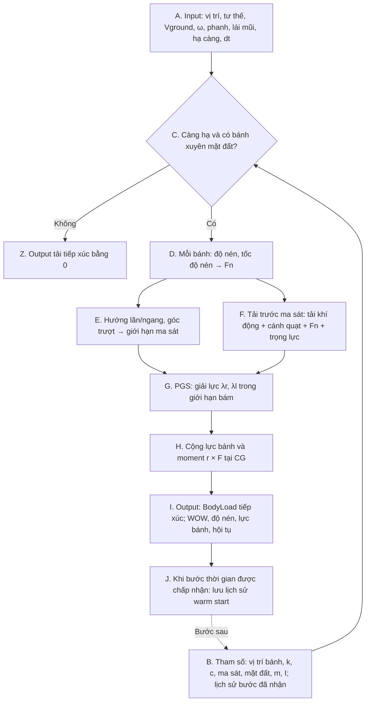
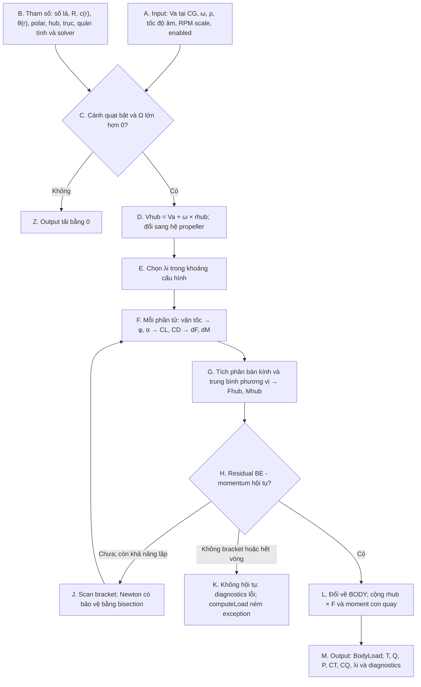

# Sơ đồ tính tải các bộ phận của mô hình T-6C

## 1. Phạm vi và cách sử dụng trong báo cáo

Tài liệu trình bày luồng tính lực và moment của sáu bộ phận để bổ sung sau **Hình 2.9 - Kiến trúc hệ thống mô phỏng**. Mỗi bộ phận có một đoạn mô tả chức năng, sơ đồ Mermaid, bảng giải thích các khối và công thức tương ứng với mã nguồn. Các nhãn A, B, C… được dùng thống nhất giữa sơ đồ và bảng của từng bộ phận.

**Mốc đối chiếu ngày 25/09/2026:**

| Nguồn | Phiên bản/phạm vi |
|---|---|
| Nhánh phát triển | `calibration/t6c-datcom-fdr-v1` |
| Commit mã nguồn làm căn cứ | [`9e3e247588d179162c9f183fa1e3e5f7a5906596`](https://github.com/huynguyen2909/Trainer-Aircraft-6DOF-Nonlinear-Model/tree/9e3e247588d179162c9f183fa1e3e5f7a5906596). Commit này bổ sung tài liệu; lõi tính tải kế thừa `024ffa6`. |
| Nhánh `main` được đối chiếu | [`6109e7d04a4e4932b17584ac9f29b03450358b26`](https://github.com/huynguyen2909/Trainer-Aircraft-6DOF-Nonlinear-Model/tree/6109e7d04a4e4932b17584ac9f29b03450358b26) tại thời điểm kiểm tra |
| Tài liệu seminar | `[Seminar] Mô hình ĐLHB MBCB(1).pdf`, 53 trang; phần lõi các bộ phận ở trang 14–44. Số trang dưới đây là số trang PDF, trùng số slide tại các trang được dẫn. |
| Đường chạy hiệu chỉnh dọc | [`tools/t6c_trim_loads.cpp`](../tools/t6c_trim_loads.cpp): wing seed, tail seed kèm downwash, fuselage DATCOM, fin proxy và propeller proxy có hệ số nhân tải. |

Các sơ đồ mô tả **tính tải trong mỗi lần đánh giá trạng thái**, không phải quy trình sinh seed DATCOM. Hình học và hệ số được khởi tạo trước khi tính tải. Việc một lớp đã có công thức tổng quát không có nghĩa mọi hệ số của lớp đã được hiệu chỉnh cho T-6C: đuôi đứng trong chương trình trim hiện dùng proxy lực cản cố định, chưa có factory seed T-6C riêng. Càng đáp được mô tả để hoàn chỉnh kiến trúc; chương trình trim bay tự do không đăng ký bộ phận này.

**Gợi ý chú thích hình:** “Sơ đồ tính tải cánh chính/đuôi ngang/đuôi đứng/thân máy bay/càng đáp/cánh quạt. Nguồn: tác giả tổng hợp từ mã nguồn nhánh hiệu chỉnh, commit `9e3e247`.” Có thể đánh số sáu hình lần lượt 2.10–2.15 nếu phù hợp thứ tự báo cáo.

## 2. Quy ước chung và giao diện với khối 6DOF

| Ký hiệu | Ý nghĩa và quy ước |
|---|---|
| BODY $B$ | Hệ FRD tại CG: $x_B$ ra trước, $y_B$ sang phải, $z_B$ xuống dưới. |
| $\mathbf V_a^B$ | Vận tốc máy bay tương đối với không khí tại CG, bằng vận tốc so với đất trừ vận tốc gió, cùng biểu diễn trong BODY. |
| $\boldsymbol\omega^B=(p,q,r)^T$ | Tốc độ góc thân, rad/s; $q$ khác áp suất động $\bar q$. |
| $\mathbf r_i^B$ | Vector từ CG đến điểm đặt tải hoặc điểm tham chiếu của bộ phận. |
| $\bar q=\tfrac12\rho V^2$ | Áp suất động, Pa; các đuôi dùng vận tốc cục bộ của chúng. |
| $\mathbf F_i^B=(X_i,Y_i,Z_i)^T$ | Lực của bộ phận, N. |
| $\mathbf M_{i,CG}^B=(\ell_i,m_i,n_i)^T$ | Moment bộ phận quanh CG, N·m; dùng $\ell$ để tránh nhầm với lực nâng $L$. |
| Góc và hệ số | Runtime dùng rad và đạo hàm theo rad. Riêng cấu hình wing và trục tra flap có trường theo độ; góc trượt bánh dùng độ trong hàm Pacejka. |

`EvaluationContext` cung cấp trạng thái, điều khiển, môi trường, điều kiện bay và đặc tính khối lượng. Tải của các bộ phận khí động/cánh quạt có giao diện `ILoadComponent::computeLoad(context)` trả về `BodyLoad`:

```cpp
struct BodyLoad {
    Vec3 forceBodyN;             // BODY, N, không chứa trọng lực
    Vec3 momentAboutCgBodyNm;    // BODY, N.m, đã quy về CG
};
```

Với moment được xác định tại điểm tham chiếu, phép chuyển là:

$$
\mathbf M_{i,CG}^B=\mathbf M_{i,ref}^B+\mathbf r_i^B\times\mathbf F_i^B.
$$

`makeBodyLoadAtPoint()` thực hiện phép chuyển này cho đuôi và fuselage cũ. Wing chuyển ngay ở cấp hệ số; fuselage DATCOM đã dùng hệ số moment quanh CG; propeller tự cộng moment cánh tay đòn và moment con quay. **`LoadAccumulator` chỉ cộng tải, không chuyển điểm đặt lần nữa.**

$$
\mathbf F_\Sigma^B=\sum_i\mathbf F_i^B,\qquad
\mathbf M_{\Sigma,CG}^B=\sum_i\mathbf M_{i,CG}^B,
$$
$$
\dot{\mathbf V}^B=\frac{\mathbf F_\Sigma^B}{m}+\mathbf g^B
-\boldsymbol\omega^B\times\mathbf V^B,\qquad
\dot{\boldsymbol\omega}^B=\mathbf I_B^{-1}
\left[\mathbf M_{\Sigma,CG}^B-\boldsymbol\omega^B\times(\mathbf I_B\boldsymbol\omega^B)\right].
$$

Ở đây $\mathbf V^B$ trong phương trình Newton–Euler là vận tốc so với đất biểu diễn trong BODY. `RigidBody6DOF` thêm trọng lực một lần. RK4 gọi lại luồng đánh giá tải tại từng trạng thái trung gian. Càng đáp đi qua giao diện riêng `IGroundContactComponent` để giải tiếp xúc phụ thuộc tải tổng.

**Mã đối chiếu:** [`FlightTypes.hpp`](../include/trainer_aircraft/core/FlightTypes.hpp), [`TrainerAircraftModel.cpp`](../src/TrainerAircraftModel.cpp), [`LoadAccumulator.cpp`](../src/LoadAccumulator.cpp), [`RigidBody6DOF.cpp`](../src/RigidBody6DOF.cpp).

## 3. Cánh chính - Main Wing, flap và aileron

### 3.1. Chức năng và sơ đồ

Cánh chính tạo lực nâng, lực cản, lực ngang và ba thành phần moment. Flap làm thay đổi các hệ số khí động dọc; aileron đi vào các đạo hàm khí động ngang. Với seed T-6C hiện tại, gia số flap được nội suy từ bảng. Tải được biến đổi sang BODY và moment được quy về CG trước khi trả cho bộ cộng tải.



### 3.2. Input, tham số và công thức theo khối

| Khối | Công thức/chức năng theo mã nguồn | Hàm hoặc dữ liệu |
|---|---|---|
| A | Đọc $V,\alpha,\beta$ từ `flightCondition`; $p,q,r$ từ `state`; $\rho,\delta_a,\delta_f$ từ môi trường/điều khiển. | `readRuntimeInputs()` |
| B | $S,AR,\bar c,\lambda,\Lambda_{LE},i_w,e$; tùy chọn $\Lambda_{c/4},S_{wf}$; $h_{AC},h_{CG},z_{AC},z_{CG}$; hệ số dọc/ngang, giới hạn điều khiển, bảng flap. | `VATC_MainWingConfig`; `makeT6CWingCalibrationSeed()` |
| C | $b=\sqrt{SAR}$, $\alpha_w=\alpha+i_w$, $\bar q=\rho V^2/2$. $\hat q=q\bar c/(2V)$; chuẩn hóa tốc độ góc bằng 0 ở vận tốc rất nhỏ. Điều khiển ngoài miền gây lỗi, không tự clamp. | `calculateGeometry()`, kiểm tra input |
| D | Nội suy tuyến tính $\Delta C_{Lf}(\delta_f),\Delta C_{D,pf}(\delta_f),\Delta C_{m,AC,f}(\delta_f)$. | `tabulated_flap.enabled=true` trong seed T-6C |
| E | $C_L=C_{L0}+C_{L\alpha}\alpha_w+C_{Lq}\hat q+\Delta C_{Lf}$. $C_D=C_{D0}+C_L^2/(\pi e AR)+\Delta C_{D,pf}+k_f(\Delta C_{Lf})^2$. $C_{m,AC}=C_{m0}+C_{m\alpha}\alpha_w+C_{mq}\hat q+\Delta C_{m,AC,f}$. | `calculateLongitudinalAerodynamics()`; $k_f$ là `extra_induced_factor` |
| F | Với $j\in\{Y,\ell,n\}$: $C_j=C_{j\beta}\beta+C_{jp}\hat p+C_{jr}\hat r+C_{j\delta_a}\delta_a$; $\hat p=pb/(2V),\hat r=rb/(2V)$ khi đạo hàm ở BODY. | `calculateLateralAerodynamics()` |
| G | $C_X=-C_D\cos\alpha+C_L\sin\alpha$; $C_Z=-C_L\cos\alpha-C_D\sin\alpha$; $C_Y$ giữ nguyên. | `calculateBodyAxisCoefficients()`; phép đổi lực dọc bỏ ghép với $\beta$ |
| H | $d_x=(h_{CG}-h_{AC})\bar c$, $d_z=z_{AC}-z_{CG}$. $C_{m,CG}=C_{m,AC}+(d_z/\bar c)C_X-(d_x/\bar c)C_Z$; $C_{\ell,CG}=C_{\ell,AC}-(d_z/b)C_Y$; $C_{n,CG}=C_{n,AC}+(d_x/b)C_Y$. | Chuyển tương đương $\mathbf r=(d_x,0,d_z)^T$ |
| I | $\mathbf F_w^B=\bar qS(C_X,C_Y,C_Z)^T$; $\mathbf M_{w,CG}^B=\bar qS(bC_{\ell,CG},\bar cC_{m,CG},bC_{n,CG})^T$. | `calculateDimensionalLoads()` → `BodyLoad` |

Khi cấu hình đạo hàm theo hệ stability, mã đổi $p,r$ sang hệ đó bằng góc `stability_angle_deg`, tính hệ số rồi xoay cặp $C_\ell,C_n$ về BODY. Seed T-6C đang chọn `derivative_axes="body"`, nên không có phép xoay này trong đường chạy hiệu chỉnh.

Wing lấy vận tốc và góc dòng tới tại CG từ `flightCondition`; lớp không cộng riêng vận tốc $\boldsymbol\omega\times\mathbf r_{AC}$ như các đuôi. Ảnh hưởng tốc độ quay được đưa vào qua các đạo hàm $C_{Lq},C_{mq},C_{jp},C_{jr}$ đã cấu hình.

Lớp vẫn giữ nhánh flap Roskam khi `tabulated_flap.enabled=false`: tra các bảng $K_b,K_p,K_\lambda,k',R_m$, tính gia số lift/drag và năm hạng moment; tùy `flap_moment_mode` có trừ baseline tại flap bằng 0. Nhánh đó không phải nhánh đang chọn trong seed T-6C. Bảng flap seed có miền 0–60°, giới hạn aileron tương đương trong cấu hình hiện tại là ±15,5°.

**Đối chiếu seminar trang 20–21:** cần bổ sung $C_{Lq}\hat q,C_{mq}\hat q$, bảng flap của seed T-6C và phân biệt $C_{m,AC}$ với $C_{m,CG}$. Công thức moment trên slide chủ yếu thể hiện cánh tay đòn; sơ đồ mới thể hiện cả moment riêng tại AC. Khi đã dùng khối H, không cộng thêm cánh tay đòn lần nữa.

**Mã đối chiếu:** [`VATC_MainWing.cpp`](../src/components/wings/VATC_MainWing.cpp), [`VATC_MainWing.hpp`](../include/trainer_aircraft/components/wings/VATC_MainWing.hpp), [`T6CWingSeed.cpp`](../src/config/T6CWingSeed.cpp). Xem nguồn và giả thiết seed tại [`T6C_MAIN_WING_DATCOM_SEED.md`](T6C_MAIN_WING_DATCOM_SEED.md).

## 4. Cánh đuôi ngang - Horizontal Stabilizer và elevator

### 4.1. Chức năng và sơ đồ

Đuôi ngang tạo lực khí động và moment chúc ngóc để góp phần cân bằng, ổn định và điều khiển chuyển động dọc. Khối sử dụng vận tốc cục bộ gồm vận tốc dòng tới, ảnh hưởng quay của thân và dòng sau cánh chính. Downwash được tính thành gia số vận tốc; elevator làm thay đổi góc tấn hiệu dụng và moment riêng tại tâm khí động.



### 4.2. Input, tham số và công thức theo khối

| Khối | Công thức/chức năng theo mã nguồn | Hàm hoặc dữ liệu |
|---|---|---|
| A | $\mathbf V_a^B,\boldsymbol\omega^B,\rho,\delta_e$, thêm $\delta_f$ cho wake. | `EvaluationContext` |
| B | $S_h,b_h,\bar c_h,i_h,\mathbf r_h,\alpha_{0L,h},a_h,C_{D0,h},k_h,\tau_e,C_{m0,h},C_{m\alpha,h},C_{m\delta_e,h}$, giới hạn elevator; các tham số wake ở dưới. | `HorizontalStabilizerConfig`, `WingTailFlowConfig` |
| C | $\epsilon=\epsilon_{ref}+\epsilon_\alpha(\alpha_B-\alpha_{ref})+\epsilon_{\delta_f}(\delta_f-\delta_{f,ref})$. Xoay dòng để giảm góc tấn, nhân tốc độ với $\sqrt\eta$, rồi trừ dòng ban đầu để lấy $\Delta\mathbf V_{wake}$. | `WingTailFlowField::evaluateDetailed()` |
| D | $\delta_e^*=\operatorname{clamp}(\delta_e,\delta_{e,min},\delta_{e,max})$; $\mathbf V_h^B=\mathbf V_a^B+\boldsymbol\omega^B\times\mathbf r_h^B+\Delta\mathbf V_{wake}^B$. | `evaluateDetailed()`, `calculateVelocityComponents()` |
| E | $V_h=\|\mathbf V_h\|$; $\alpha_f=\operatorname{atan2}(w_h,u_h)$; $\alpha_{eff}=\alpha_f+i_h-\alpha_{0L,h}+\tau_e\delta_e^*$; $\bar q_h=\rho V_h^2/2$. | `calculateAngleOfAttack()`, `calculateDynamicPressure()` |
| F | $C_{Lh}=a_h\alpha_{eff}$, $C_{Dh}=C_{D0,h}+k_hC_{Lh}^2$; $L_h=\bar q_hS_hC_{Lh}$, $D_h=\bar q_hS_hC_{Dh}$. | `calculateAerodynamicCoefficients()`, `calculateForces()` |
| G | $C_{m,AC,h}=C_{m0,h}+C_{m\alpha,h}\alpha_{eff}+C_{m\delta_e,h}\delta_e^*$; $\mathbf M_{AC,h}^B=(0,\bar q_hS_h\bar c_hC_{m,AC,h},0)^T$. | `calculateAerodynamicCenterMoment()` |
| H–I | $\mathbf F_h^B=L_h\mathbf e_L+D_h\mathbf e_D$; $\mathbf M_{h,CG}^B=\mathbf M_{AC,h}^B+\mathbf r_h^B\times\mathbf F_h^B$. | `calculateBodyForces()`, `makeBodyLoadAtPoint()` |

Với $\mathbf V_a^B=(u,v,w)^T$, phép tính wake chính xác là:

$$
\mathbf V_{wake}^B=\sqrt\eta
\begin{bmatrix}
u\cos\epsilon+w\sin\epsilon\\
v\\
-u\sin\epsilon+w\cos\epsilon
\end{bmatrix},\qquad
\Delta\mathbf V_{wake}^B=\mathbf V_{wake}^B-\mathbf V_a^B.
$$

Hướng lực của đuôi được tính bằng vector, không xoay theo góc incidence hoặc elevator:

$$
\mathbf e_D=-\frac{(u_h,v_h,w_h)^T}{V_h},\qquad
\mathbf e_L=\frac{(w_h,0,-u_h)^T}{\sqrt{u_h^2+w_h^2}}.
$$

Mã đặt hướng lực bằng 0 khi mẫu số tương ứng quá nhỏ. Góc trượt $\beta_h=\operatorname{atan2}(v_h,\sqrt{u_h^2+w_h^2})$ cũng được trả về để chẩn đoán.

**Chi tiết ghép wing–tail:** hệ số wake được khởi tạo trước; `WingTailFlowField` đọc $\alpha_B,\delta_f$ từ context, không gọi `MainWing::computeLoad()` và không lấy trực tiếp $C_L$ vừa tính của wing. Do đó, thay đổi `wing.CL0` khi optimize không tự tính lại seed wake. $\eta$ tác động lên vận tốc dòng tự do trước khi cộng $\boldsymbol\omega\times\mathbf r_h$; không nhân $\eta$ vào lực đuôi thêm lần nữa. Không có trễ vận chuyển wake hoặc slipstream propeller tự động trong factory đuôi hiện tại.

Các trường `MomentArm`, `TailAR`, `ElevatorArea` được lưu/kiểm tra trong cấu hình nhưng không thay thế phép $\mathbf r_h\times\mathbf F_h$ hay tự tính lại hiệu quả elevator trong mỗi lần đánh giá. Tải runtime dùng trực tiếp hệ số và vị trí đã cấu hình.

**Đối chiếu seminar trang 22–24:** trang 22 viết $\tan^{-1}(u_h/w_h)$; mã dùng **$\operatorname{atan2}(w_h,u_h)$**. Các moment bằng 0 trên slide chỉ là moment riêng ở AC theo trục tương ứng; moment quanh CG vẫn có đóng góp từ cánh tay đòn. Factory mới nối `WingTailFlowField` vào giao diện `ILocalFlowField` vốn đã có ở lớp đuôi trên `main`.

**Mã đối chiếu:** [`VATC_HorizontalStabilizer.cpp`](../src/components/stabilizers/VATC_HorizontalStabilizer.cpp), [`WingTailFlowField.cpp`](../src/components/WingTailFlowField.cpp), [`T6CTailSeed.cpp`](../src/config/T6CTailSeed.cpp). Seed: [`T6C_HORIZONTAL_TAIL_DATCOM_SEED.md`](T6C_HORIZONTAL_TAIL_DATCOM_SEED.md).

## 5. Cánh đuôi đứng - Vertical Stabilizer và rudder

### 5.1. Chức năng và sơ đồ

Đuôi đứng tạo lực ngang, lực cản và moment hướng. Góc trượt cục bộ phụ thuộc chuyển động tịnh tiến, tốc độ góc thân và trường dòng bổ sung nếu được cấp. Rudder thay đổi góc trượt hiệu dụng. Lực ngang đặt lệch CG có thể sinh cả moment liệng và moment hướng, dù moment liệng riêng tại AC bằng 0.



### 5.2. Input, tham số và công thức theo khối

| Khối | Công thức/chức năng theo mã nguồn | Hàm hoặc dữ liệu |
|---|---|---|
| A–B | $\mathbf V_a^B,\boldsymbol\omega^B,\rho,\delta_r$; $S_v,\bar c_v,\mathbf r_v,i_v,a_v,\tau_r,C_{D0,v},k_v,C_{n0,v},C_{n\beta,v},C_{n\delta_r,v}$, giới hạn rudder. | `VerticalStabilizerConfig` |
| C–D | $\mathbf V_v^B=\mathbf V_a^B+\boldsymbol\omega^B\times\mathbf r_v^B+\Delta\mathbf V_v^B$; $\delta_r^*=\operatorname{clamp}(\delta_r,\delta_{r,min},\delta_{r,max})$. Không cấp `ILocalFlowField` thì $\Delta\mathbf V_v=0$. | `calculateVelocityComponents()` |
| E | $\beta_f=\operatorname{atan2}(v_v,\sqrt{u_v^2+w_v^2})$; $\beta_{eff}=\beta_f+i_v-\tau_r\delta_r^*$; $\bar q_v=\rho V_v^2/2$. | `calculateSideSlipAngle()`, `calculateDynamicPressure()` |
| F | $C_{Yv}=-a_v\beta_{eff}$; $C_{Dv}=C_{D0,v}+k_vC_{Yv}^2$; $\mathcal Y_v=\bar q_vS_vC_{Yv}$; $D_v=\bar q_vS_vC_{Dv}$. | `calculateAerodynamicCoefficients()`, `calculateForces()` |
| G | $C_{n,AC,v}=C_{n0,v}+C_{n\beta,v}\beta_{eff}+C_{n\delta_r,v}\delta_r^*$; $\mathbf M_{AC,v}^B=(0,0,\bar q_vS_v\bar c_vC_{n,AC,v})^T$. | `calculateAerodynamicCenterMoment()`; chiều dài chuẩn ở đây là **TailMAC**, không phải sải cánh chính |
| H–I | $\mathbf F_v^B=\mathcal Y_v\mathbf e_Y+D_v\mathbf e_D$; $\mathbf M_{v,CG}^B=\mathbf M_{AC,v}^B+\mathbf r_v^B\times\mathbf F_v^B$. | `calculateBodyForces()`, `makeBodyLoadAtPoint()` |

$$
\mathbf e_Y=\frac{(-v_v,u_v,0)^T}{\sqrt{u_v^2+v_v^2}},\qquad
\mathbf e_D=-\frac{(u_v,v_v,w_v)^T}{V_v}.
$$

Tại dòng thẳng theo $+x_B$, $C_Y>0$ tương ứng lực theo $+y_B$. Với rudder bằng 0, $i_v=0$, $\beta>0$ và $a_v>0$, mô hình cho $C_Y<0$. Tương tự đuôi ngang, có bảo vệ khi vận tốc bằng 0. `MomentArm`, `RudderArea`, `TailAR` không được dùng để tự sinh lại đạo hàm trong công thức runtime này.

**Cấu hình đang dùng trong trim:** chương trình đặt `Area=2 m²`, `TailSpan=2 m`, `TailMAC=1 m`, `CD0=0.009`, vị trí ((-5,0,-0.9)) m và không cấp trường dòng riêng. Đây là proxy lực cản giữ cố định trong optimize; không nên ghi rằng đã hoàn tất hiệu chỉnh khí động ngang T-6C chỉ từ sơ đồ tổng quát này.

**Đối chiếu seminar trang 25–27:** công thức lực ngang ở trang 25 phải dùng $\mathcal Y_v=\bar q_vS_vC_{Yv}$, thay ký hiệu $C_{Lv}$ trên slide. Dòng $\ell_v=0,m_v=0$ chỉ đúng cho moment riêng tại AC; sau chuyển về CG có thể xuất hiện các moment này. Lõi lớp đuôi đứng không đổi công thức so với `main` được đối chiếu.

**Mã đối chiếu:** [`VATC_VerticalStabilizer.cpp`](../src/components/stabilizers/VATC_VerticalStabilizer.cpp), [`VATC_VerticalStabilizer.hpp`](../include/trainer_aircraft/components/stabilizers/VATC_VerticalStabilizer.hpp), [`t6c_trim_loads.cpp`](../tools/t6c_trim_loads.cpp).

## 6. Thân máy bay - Fuselage DATCOM dùng trong hiệu chỉnh

### 6.1. Chức năng và sơ đồ

Thân máy bay đóng góp lực cản, lực pháp tuyến và moment chúc ngóc. Đường chạy hiệu chỉnh dùng `DatcomFuselageComponent`: lực cản phụ thuộc Reynolds và Mach, lực pháp tuyến tuyến tính theo góc tấn, còn moment được xác định trực tiếp quanh CG. Các trạm hình học được xử lý khi tạo seed; khối runtime nhận diện tích ướt, form factor và các hệ số tổng hợp.



### 6.2. Input, tham số và công thức theo khối

| Khối | Công thức/chức năng theo mã nguồn | Hàm hoặc dữ liệu |
|---|---|---|
| A | $\mathbf V_a^B,V,\alpha,M,\rho,\mu$; $M$ là Mach, $\mu$ là độ nhớt động lực. | `flightCondition`, `environment` |
| B | $S_{ref},\bar c_{ref},L_f,S_{wet},FF,C_{D,base},C_{N\alpha},C_{m0},C_{m\alpha}$. Hệ số dùng diện tích/MAC cánh chính làm chuẩn; moment seed đã quy về CG. | `DatcomFuselageConfig`; `makeT6CFuselageDatcomSeed()` |
| C/Z | Input không hợp lệ gây lỗi. Trả tải 0 khi $V<10^{-10}$ m/s, $\rho=0$ hoặc $Re\le1$, để tránh miền không xác định của logarit. | `DatcomFuselageComponent::computeLoad()` |
| D | $Re=\rho VL_f/\mu$; $C_f=0.455/[(\log_{10}Re)^{2.58}(1+0.144M^2)^{0.65}]$. | `computeLoad()` |
| E | $C_{D0,f}=C_f FF S_{wet}/S_{ref}+C_{D,base}$. | Hệ số cản cập nhật theo điều kiện bay |
| F–G | $D_f=\bar qS_{ref}C_{D0,f}$; $N_f=\bar qS_{ref}C_{N\alpha}\alpha$; $m_{f,CG}=\bar qS_{ref}\bar c_{ref}(C_{m0}+C_{m\alpha}\alpha)$. | $N_f$ ở đây là lực pháp tuyến, không phải moment hướng |
| H–I | $\mathbf F_f^B=-D_f\mathbf V_a^B/V+(0,0,-N_f)^T$; $\mathbf M_{f,CG}^B=(0,m_{f,CG},0)^T$. | Trả trực tiếp `BodyLoad`; không cộng thêm $\mathbf r\times\mathbf F$ |

Lực pháp tuyến được đặt theo $-z_B$, không phải lực nâng vuông góc dòng tới. Thành phần $Y_f$ vẫn có thể khác 0 do hướng của lực cản khi có trượt ngang, nhưng lớp DATCOM hiện không có đạo hàm lực ngang thân riêng, moment hướng riêng hay các đạo hàm damping của thân.

### 6.3. Khác biệt với fuselage trong seminar và `main`

| Nội dung | `FuselageComponent` cũ, seminar trang 28–34 | `DatcomFuselageComponent` trong trim hiện tại |
|---|---|---|
| Hình học | Mũi nón, cabin trụ, đuôi nón cụt; diện tích tính từ $L_n,L_c,L_t,d_f,d_b$. | Seed tổng hợp từ trạm hình học proxy PC-9M; runtime nhận $S_{wet},FF,L_f$. |
| Cản | Cản ma sát, đáy, upsweep và gia số kính chắn gió. | $C_fFFS_{wet}/S_{ref}+C_{D,base}$; không gọi riêng các công thức upsweep/kính của lớp cũ. |
| Lực pháp tuyến | Không có thành phần riêng; lực khí động là drag. | Có $C_N=C_{N\alpha}\alpha$. |
| Moment | Tương quan kiểu Nicolosi có anchor/sensitivity cho $C_{m0},C_{m\alpha},C_{n\beta}$; chuẩn $S_{front}d_f$, rồi chuyển điểm đặt theo cấu hình. | $C_{m0},C_{m\alpha}$ đã quy về CG; chuẩn $S_{ref}\bar c_{ref}$; moment hướng bằng 0. |
| Chọn mô hình | Lớp cũ vẫn tồn tại, có `makeT6cReferenceFuselageConfig()`. | `makeT6CFuselageWithDatcomSeed()` tạo lớp mới; đó là lớp được gọi bởi chương trình trim. |

Hai lớp là hai lựa chọn thay thế. Không cộng đồng thời tải của chúng để biểu diễn cùng một thân máy bay. Khi chuyển hệ số giữa hai lớp phải chuyển cả diện tích/chiều dài tham chiếu và điểm lấy moment.

**Mã đối chiếu:** [`DatcomFuselageComponent.cpp`](../src/components/fuselage/DatcomFuselageComponent.cpp), [`T6CFuselageSeed.cpp`](../src/config/T6CFuselageSeed.cpp); mô hình cũ: [`FuselageComponent.cpp`](../src/components/fuselage/FuselageComponent.cpp), [`FuselageAerodynamics.cpp`](../src/components/fuselage/FuselageAerodynamics.cpp). Seed: [`T6C_FUSELAGE_DATCOM_SEED.md`](T6C_FUSELAGE_DATCOM_SEED.md).

## 7. Càng đáp - Landing Gear và bộ giải PGS

### 7.1. Chức năng và sơ đồ

Càng đáp tính phản lực pháp tuyến, lực lăn/phanh và lực ngang khi bánh tiếp xúc đất. Phản lực pháp tuyến được tính trước từ lò xo–giảm chấn. Các lực ma sát được giải đồng thời bằng Projected Gauss–Seidel (PGS), sử dụng cả tải khí động, cánh quạt và trọng lực để dự đoán xu hướng trượt. Kết quả trả về là tải tiếp xúc trong BODY quanh CG.



### 7.2. Input, tham số và công thức theo khối

| Khối | Công thức/chức năng theo mã nguồn | Hàm hoặc dữ liệu |
|---|---|---|
| A | Vị trí CG NED, quaternion $Q_{NB}$, vận tốc **so với đất** trong BODY, $\boldsymbol\omega$, tín hiệu phanh trái/phải, góc lái mũi, `landingGearExtended`, $\Delta t$. | `EvaluationContext`, `evaluateContacts()` |
| B | Vị trí bánh chưa nén $\mathbf r_{0i}$, độ cứng $k_i$, giảm chấn $c_i$, hệ số lăn/tĩnh, hệ số Pacejka $B_i,C_i,E_i$, nhóm phanh, giới hạn lái, giới hạn lực strut, mặt đất; $m,\mathbf I$, số vòng/ngưỡng hội tụ PGS. | `GearParameters`, `LandingGearParameters`; lịch sử là trạng thái nội bộ, không phải tham số tĩnh |
| C | $\mathbf p_{wi}^N=\mathbf p_{CG}^N+C_{NB}\mathbf r_{0i}^B$; $d_i=p_{wi,z}^N-z_g$. Có tiếp xúc nếu càng hạ và $d_i>0$. | `evaluateGear()`; mặt đất phẳng, đứng yên |
| D | $\mathbf n^B=C_{BN}(0,0,-1)^T$; $s=\max(10^{-6},-n_z^B)$; $\xi_i=\max(0,d_i/s)$; $\mathbf r_i=\mathbf r_{0i}+(0,0,-\xi_i)^T$. $\dot\xi_i=-(\mathbf V^B+\boldsymbol\omega\times\mathbf r_i)\cdot\mathbf n^B/s$, giới hạn độ lớn bởi $\xi_i/\Delta t$. | `evaluateGear()`; khi $\Delta t\le10^{-9}$, tốc độ nén dùng bằng 0 |
| D | $F_{strut}=\min(-k_i\xi_i-c_i\dot\xi_i,0)$, áp giới hạn lực strut nếu bật; $F_{ni}=\max(0,-F_{strut}/s)$. | Phản lực pháp tuyến không nhận giá trị kéo xuống đất |
| E | Hướng lăn là $(\cos\delta_s,\sin\delta_s,0)^T$ chiếu lên mặt đất rồi chuẩn hóa; hướng ngang là $\operatorname{normalize}(\mathbf n\times\mathbf e_r)$. Góc trượt $\chi_i=-\operatorname{atan2}(v_l,\lvert v_r\rvert)$, đổi sang độ. | `evaluateGear()`; ở tốc độ phẳng ≤ $3\times10^{-4}$ m/s giữ góc trượt từ lịch sử |
| E | Giới hạn $\lvert\lambda_{ri}\rvert\le\lvert\mu_{xi}F_{ni}\rvert$, $\lvert\lambda_{li}\rvert\le\lvert\mu_{yi}F_{ni}\rvert$; công thức hệ số ở dưới. | `evaluateContacts()` |
| F | Tải trước ma sát = tổng tải các bộ phận bay + phản lực pháp tuyến + trọng lực tại CG. | `TrainerAircraftModel::evaluateCoupled()` |
| G | Giải các lực ma sát theo đáp ứng vận tốc/quay của vật rắn và giới hạn từng hướng; warm start lấy từ bước đã chấp nhận. | `PGSFrictionSolver::solve()` |
| H–I | $\mathbf F_i=F_{ni}\mathbf n+\lambda_{ri}\mathbf e_{ri}+\lambda_{li}\mathbf e_{li}$; $\mathbf F_{LG}=\sum_i\mathbf F_i$; $\mathbf M_{LG,CG}=\sum_i\mathbf r_i\times\mathbf F_i$. | `applyFrictionResult()`; `GroundContactEvaluation::totalLoad` |
| J | Lưu lực ma sát và trạng thái tiếp xúc khi bước tích phân được nhận. Đánh giá các stage RK4 không ghi đè lịch sử đã nhận. | `commitAcceptedStep()` |

Với $f_r,f_s$ là hệ số nhân rolling/static friction toàn cục và $b_i\in[0,1]$ là mức phanh:

$$
\mu_{xi}=f_r\mu_{roll,i}+b_i f_s(\mu_{static,i}-\mu_{roll,i}),
$$
$$
x_i=B_i\chi_{i,deg},\qquad
\mu_{yi}=f_s\mu_{static,i}\sin\left[C_i\arctan\left(x_i-E_i(x_i-\arctan x_i)\right)\right].
$$

Bánh không có phanh chỉ dùng hạng $f_r\mu_{roll,i}$. Giới hạn hai hướng được áp độc lập thành một hộp giới hạn lực; mã hiện tại không giải ellipse ma sát kết hợp.

Để mô tả PGS, đặt $\mathbf J_i=[\mathbf e_i^T\; (\mathbf r_i\times\mathbf e_i)^T]$, $\mathcal M=\operatorname{diag}(m\mathbf 1,\mathbf I_B)$, $\mathbf A=\mathbf J\mathcal M^{-1}\mathbf J^T$. Khi $\Delta t>10^{-9}$:

$$
\mathbf a_{pre}=\mathbf F_{pre}/m-\boldsymbol\omega\times\mathbf V^B,\quad
\dot{\boldsymbol\omega}_{pre}=\mathbf I_B^{-1}[\mathbf M_{pre}-\boldsymbol\omega\times(\mathbf I_B\boldsymbol\omega)],
$$
$$
b_i=-\mathbf e_i\cdot\left[\mathbf a_{pre}+\mathbf V^B/\Delta t+
(\dot{\boldsymbol\omega}_{pre}+\boldsymbol\omega/\Delta t)\times\mathbf r_i\right],
$$
$$
\lambda_i\leftarrow\operatorname{clamp}\left(
\lambda_i+\frac{b_i-\sum_j A_{ij}\lambda_j}{A_{ii}},\lambda_{i,min},\lambda_{i,max}\right).
$$

Vòng lặp dùng ngay giá trị mới cập nhật (Gauss–Seidel) và dừng theo tổng độ thay đổi lực hoặc số vòng tối đa. Khi $\Delta t$ quá nhỏ, mã bỏ các hạng chia cho $\Delta t$. Nếu giới hạn lực strut kích hoạt, mã cập nhật độ nén báo cáo sau khi đã tính vị trí tiếp xúc; đây là chi tiết thực thi cần lưu ý khi diễn giải diagnostics.

**Ghép với khung tải:** trọng lực chỉ tạm được đưa vào vế phải PGS. `BodyLoad` của càng vẫn chỉ chứa tải tiếp xúc, nên khi `RigidBody6DOF` thêm trọng lực sẽ không bị cộng hai lần. Trong trim trên không, `landingGearExtended=false` và chương trình không đăng ký bộ phận càng; mô hình càng hiện không sinh lực cản khí động khi hạ càng.

**Đối chiếu seminar trang 35–44:** lõi PGS và lò xo–giảm chấn vẫn cùng cấu trúc trên `main`. Sơ đồ này nêu rõ tải đầu vào của PGS, phép chiếu theo tư thế và thời điểm lưu lịch sử để tránh hiểu rằng ma sát có thể tính độc lập với các bộ phận khác.

**Mã đối chiếu:** [`LandingGearComponent.cpp`](../src/components/landing_gear/LandingGearComponent.cpp), [`LandingGearComponent.hpp`](../include/trainer_aircraft/components/landing_gear/LandingGearComponent.hpp), [`TrainerAircraftModel.cpp`](../src/TrainerAircraftModel.cpp), [`RK4Integrator.cpp`](../src/RK4Integrator.cpp).

## 8. Cánh quạt - Propeller BEMT

### 8.1. Chức năng và sơ đồ

Cánh quạt sử dụng Blade Element Momentum Theory (BEMT). Mỗi phần tử lá cánh tại một bán kính và góc phương vị có vận tốc tương đối riêng; polar tiết diện cho lực nâng/cản, sau đó được tích phân trên đĩa. Bộ giải tìm dòng vào cảm ứng sao cho lực dọc trục từ blade element phù hợp với momentum theory. Tải cuối gồm lực, moment khí động tại hub, moment do vị trí hub và moment con quay.



### 8.2. Input, tham số và công thức theo khối

| Khối | Công thức/chức năng theo mã nguồn | Hàm hoặc dữ liệu |
|---|---|---|
| A | $\mathbf V_a^B,\boldsymbol\omega^B,\rho,a_{sound}$, `propellerSpeedScale`, `propellerEnabled`. $\Omega=\Omega_{config}\times speedScale$. | `PropellerComponent::makeRuntimeInput()`; **không đọc `throttle`** |
| B | $N_b,R,r_0/R,c(r),\theta(r)$, polar $C_l(\alpha),C_d(\alpha)$, $C_{BP},\mathbf r_{hub}^B,I_{rot},s_\Omega\in\{-1,+1\}$, số phần tử bán kính/phương vị, miền và dung sai inflow. | `PropellerParameters`; geometry/polar bất biến trong lần đánh giá |
| C/Z | Tắt hoặc $\Omega\le10^{-12}$: trả tải 0 và trạng thái hội tụ. | `PropellerModel::evaluate()` |
| D | $\mathbf V_{hub}^B=\mathbf V_a^B+\boldsymbol\omega^B\times\mathbf r_{hub}^B$; $\mathbf V_{hub}^P=C_{BP}^T\mathbf V_{hub}^B$; $\boldsymbol\omega^P=C_{BP}^T\boldsymbol\omega^B$. | `calculateHubKinematics()` |
| D | $\lambda_0=V_{hub,x}^P/(\Omega R)$; $\mu=\sqrt{(V_{hub,y}^P)^2+(V_{hub,z}^P)^2}/(\Omega R)$; $J=V_{hub,x}^P/(nD)$, $n=\Omega/(2\pi)$. | Đại lượng chuẩn hóa ở hub |
| E–F | $v_i=\lambda_i\Omega R$; nội suy $c,\theta$ tại từng phần tử; tính vận tốc, góc và tải phần tử theo các công thức dưới. | `interpolateGeometry()`, `evaluateDiskWithKinematics()` |
| G | $\mathbf F_{hub}^P\simeq(N_b/N_\psi)\sum_{j,k}\mathbf f'_{jk}\Delta r$; $\mathbf M_{hub}^P\simeq(N_b/N_\psi)\sum_{j,k}\mathbf r_{jk}^P\times\mathbf f'_{jk}\Delta r$. | Quy tắc midpoint theo bán kính và phương vị; tải trung bình đĩa |
| H–J | $R(\lambda_i)=C_{T,rot}^{BE}-2\lambda_i\sqrt{\mu^2+(\lambda_0+\lambda_i)^2}=0$; $C_{T,rot}^{BE}=F_{hub,x}^P/[\rho\pi R^2(\Omega R)^2]$. | `evaluateResidual()`, `evaluate()` |
| K | Không bracket hoặc hết vòng: trả diagnostics không hội tụ từ model; adapter `computeLoad()` ném lỗi khi propeller bật. | Không âm thầm chấp nhận tải không hội tụ |
| L–M | $\mathbf F_p^B=C_{BP}\mathbf F_{hub}^P$; $\mathbf M_{p,CG}^B=C_{BP}\mathbf M_{hub}^P+\mathbf r_{hub}^B\times\mathbf F_p^B-\boldsymbol\omega^B\times\mathbf H_p^B$. | $\mathbf H_p^B=s_\Omega I_{rot}\Omega C_{BP}(1,0,0)^T$ |

Ở phần tử bán kính $r$, phương vị $\psi$:

$$
\mathbf e_r^P=(0,\cos\psi,\sin\psi)^T,\quad
\mathbf e_t^P=s_\Omega(\mathbf e_x^P\times\mathbf e_r^P),\quad
\mathbf r_e^P=r\mathbf e_r^P,
$$
$$
\mathbf V_e^P=\mathbf V_{hub}^P+\boldsymbol\omega^P\times\mathbf r_e^P
+\Omega r\mathbf e_t^P+\lambda_i\Omega R\mathbf e_x^P,
$$
$$
U_a=\mathbf V_e^P\cdot\mathbf e_x^P,\quad U_t=\mathbf V_e^P\cdot\mathbf e_t^P,\quad
W=\sqrt{U_a^2+U_t^2},\quad \phi=\operatorname{atan2}(U_a,U_t),\quad \alpha_e=\theta(r)-\phi,
$$
$$
L'=\tfrac12\rho W^2c(r)C_l(\alpha_e),\quad
D'=\tfrac12\rho W^2c(r)C_d(\alpha_e),
$$
$$
\mathbf f'=(L'\cos\phi-D'\sin\phi)\mathbf e_x^P
+(-L'\sin\phi-D'\cos\phi)\mathbf e_t^P.
$$

Polar chỉ dùng hai thành phần vận tốc dọc trục/tiếp tuyến, bỏ thành phần dọc sải lá. Ngoài miền polar, mã giữ giá trị đầu/cuối bảng và tăng bộ đếm `polarClampCount`; Mach tiết diện chỉ kích hoạt cảnh báo, không sửa polar theo compressibility.

Kết quả chẩn đoán thêm:

$$
T=F_{hub,x}^P,\quad Q=-s_\Omega M_{hub,x}^P,\quad P=Q\Omega,\quad
C_{T,prop}=\frac{T}{\rho n^2D^4},\quad C_{Q,prop}=\frac{Q}{\rho n^2D^5}.
$$

$C_{T,rot}$ dùng trong residual khác định nghĩa $C_{T,prop}$ theo (n,D). Moment phản lực trục và moment uốn hub là hai phần tách ra của $\mathbf M_{hub}$, đã có trong tổng moment khí động; không cộng lại chúng lần nữa. Mã có moment con quay $-\boldsymbol\omega\times\mathbf H_p$, chưa có động lực học governor/engine hoặc hạng phản lực do $\dot\Omega$.

**Trình tự solver:** tính residual ở hai đầu khoảng; nếu chưa đổi dấu thì scan trong chính khoảng cấu hình; sau khi có bracket mới dùng Newton với đạo hàm sai phân hữu hạn, thay bằng bisection khi bước Newton không hợp lệ. Miền $\lambda_i\ge0$; không có tự mở rộng miền sang inflow âm ở commit đối chiếu. Adapter gọi với initial guess cấu hình mỗi lần, không lưu inflow thành trạng thái RK4. Sơ đồ gộp các bước bracket/Newton để dễ đọc.

**Seed và hiệu chỉnh:** factory T-6C dùng 4 lá, đường kính 97 inch, tốc độ chuẩn 2000 RPM và polar proxy dạng NACA 16-series. Pitch theo bán kính được tạo trước bằng quy luật xoắn hình học rồi nội suy khi chạy; không có input collective pitch theo thời gian trong `ControlInputs`. Riêng `ScaledPropeller` trong chương trình trim nhân **cả lực và moment** với hệ số hiệu chỉnh sau khi tính BEMT; đó không phải tham số khí động tích hợp trong lớp `PropellerModel`.

**Đối chiếu seminar trang 14–19:** lõi BEMT, tích phân theo phương vị và Newton/bisection giữ cấu trúc như `main`; phần thay đổi là factory hình học/polar T-6C thay factory Navion. Cụm “blade pitch” ở input slide nên chuyển sang tham số hình học tĩnh cho đúng giao diện hiện tại. Cần thể hiện rõ moment quanh CG và cơ chế báo lỗi khi inflow không hội tụ. DATCOM hỗ trợ quy ước/đầu vào power effects trong tài liệu seed; tải runtime ở đây được tính bằng BEMT.

**Mã đối chiếu:** [`PropellerModel.cpp`](../src/components/propeller/PropellerModel.cpp), [`PropellerModel.hpp`](../include/trainer_aircraft/components/propeller/PropellerModel.hpp), [`T6CPropellerSeed.cpp`](../src/config/T6CPropellerSeed.cpp), [`t6c_trim_loads.cpp`](../tools/t6c_trim_loads.cpp). Seed: [`T6C_PROPELLER_DATCOM_SEED.md`](T6C_PROPELLER_DATCOM_SEED.md).

## 9. Bảng tổng hợp chỉnh sửa khi đưa vào báo cáo

| Vị trí seminar | Nội dung cần làm rõ/sửa | Cách trình bày trong báo cáo |
|---|---|---|
| Trang 14–19, propeller | Pitch là cấu hình cố định; runtime nhận tốc độ quay chỉ định. BEMT không đồng nghĩa governor hoặc công suất engine đã được mô hình hóa. | Dùng sơ đồ mục 8; nêu riêng giới hạn mô hình và hệ số nhân tải trong bài toán trim. |
| Trang 20–21, wing | Thêm đạo hàm tốc độ pitch; phân biệt moment riêng và moment quanh CG; dùng đúng nhánh bảng flap T-6C. | Dùng công thức mục 3; không cộng moment cánh tay đòn hai lần. |
| Trang 22, tailplane | Tỷ số góc tấn trên slide bị đảo; output moment chưa nêu rõ điểm tham chiếu. | Dùng `atan2(w,u)` và $\mathbf M_{CG}=\mathbf M_{AC}+\mathbf r\times\mathbf F$. |
| Trang 22–24, dòng sau cánh | Slide có ký hiệu $\Delta\mathbf V_h$; nhánh hiệu chỉnh đã có implementation wake cụ thể. | Bổ sung khối `WingTailFlowField`, tham số $\epsilon,\eta$ và cách cộng vận tốc. |
| Trang 25, fin | Lực ngang ghi nhầm $C_L$; moment liệng tại CG không nhất thiết bằng 0. | Dùng $C_Y$, phân biệt AC với CG; nêu trạng thái fin proxy trong bài toán trim. |
| Trang 28–34, fuselage | Seminar mô tả lớp cũ; trim dùng lớp DATCOM có pháp lực và moment pitch đã quy về CG. | Dùng sơ đồ mục 6 và bảng khác biệt, tránh trộn hệ số giữa hai hệ chuẩn. |
| Trang 35–44, gear | Cần thấy liên kết với tải các bộ phận khác và trọng lực; lịch sử không cập nhật tùy ý trong RK4. | Dùng sơ đồ mục 7; ghi rằng mô hình chỉ tính tiếp xúc mặt đất. |
| Sau Hình 2.9 | Sáu output phải có cùng quy ước BODY và CG. | Đặt đoạn quy ước ở mục 2 trước sáu sơ đồ; giữ công thức chi tiết trong bảng bên dưới hình. |

Đối với báo cáo, nên dùng đoạn “Chức năng” và sơ đồ của từng bộ phận làm nội dung chính; bảng công thức là phần thuyết minh ngay sau hình hoặc phụ lục nếu cần giảm mật độ. Các công thức ở đây được đối chiếu với implementation, không phải tuyên bố đã xác thực độ chính xác khí động của mọi bộ phận bằng FDR.
