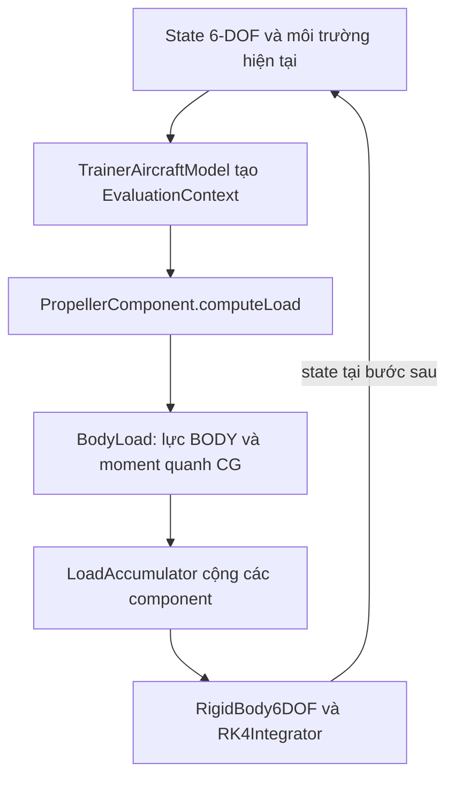
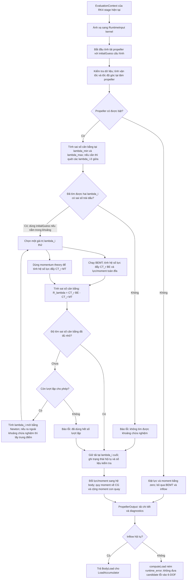
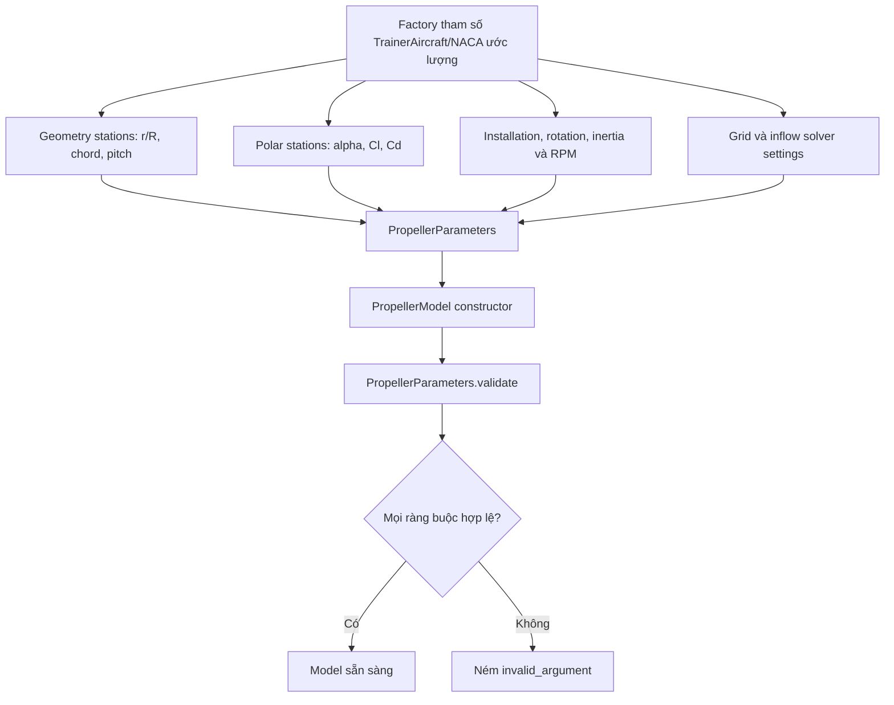
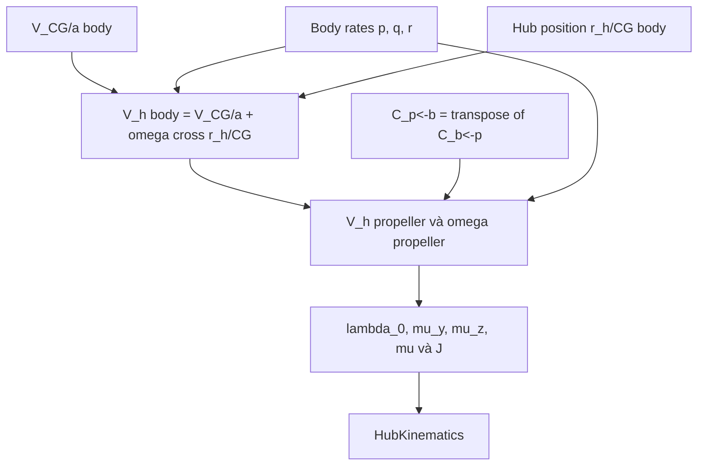
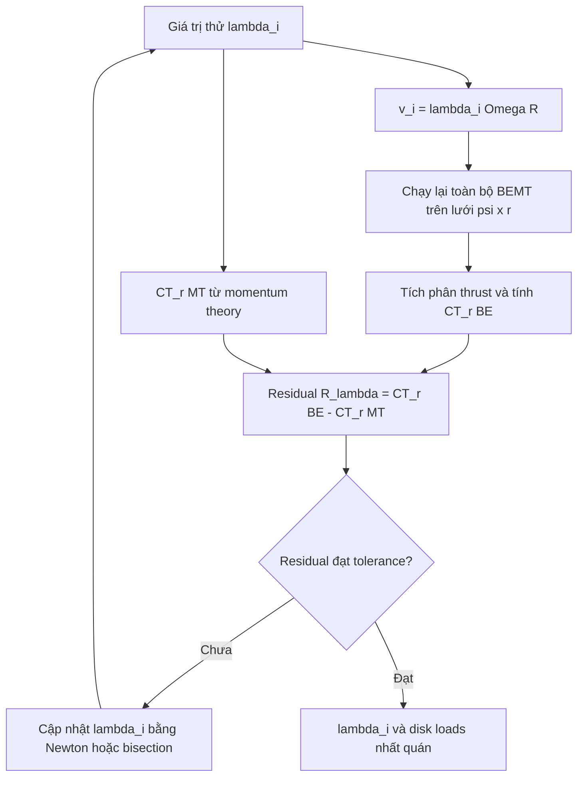
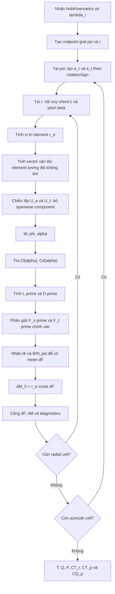
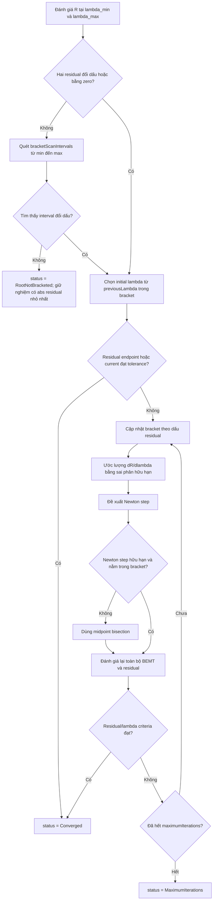
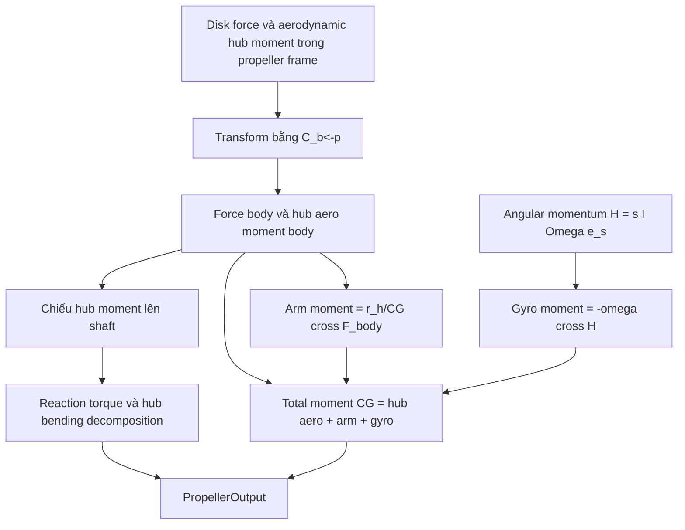
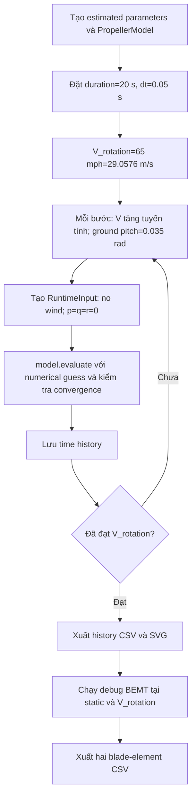
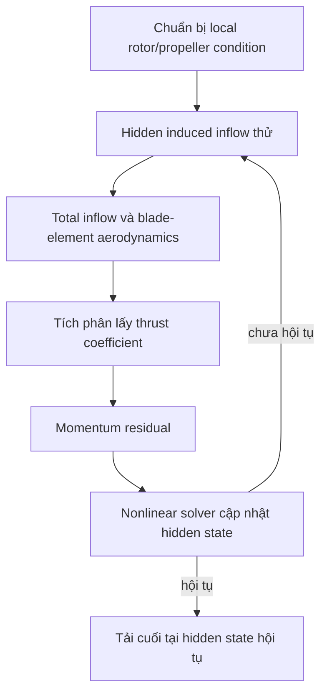

# TrainerAircraft Propeller V1 — sơ đồ luồng tính toán C++

## 1. Mục đích và phạm vi

Tài liệu này mô tả **đúng implementation hiện tại**, không phải thiết kế dự kiến
cho phiên bản sau. Các hàm chính được mô tả là:

- `makeEstimatedTrainerAircraftNaca5868_9Parameters()`;
- `PropellerParameters::validate()`;
- `PropellerComponent::computeLoad()`;
- `PropellerComponent::evaluateDetailed()`;
- `PropellerModel::evaluate()`;
- `PropellerModel::calculateHubKinematics()`;
- `PropellerModel::evaluateResidual()`;
- `PropellerModel::evaluateDiskWithKinematics()`;
- `AirfoilPolar::lookup()`.

V1 là mô hình blade-element phi tuyến ghép với **uniform momentum inflow
quasi-steady**. Một scalar `lambdaInduced` được giải đại số trong mỗi lần gọi.
RPM và blade pitch hiện bị khóa bởi cấu hình; không có engine hoặc governor.

Toàn bộ runtime API dùng SI và radian. Quy ước:

- body: `+x_b` về trước, `+y_b` sang phải, `+z_b` xuống dưới;
- propeller: `+x_p` dọc shaft theo chiều thrust dương;
- disk nằm trong mặt phẳng `y_p-z_p`;
- `C_b<-p = bodyFromPropeller` đổi thành phần vector từ propeller sang body;
- `rotationSign = +1` là chiều dương theo quy tắc bàn tay phải quanh `+x_p`;
- `psi = 0` đặt blade theo `+y_p`.

> **Cảnh báo dữ liệu:** mọi giá trị hình học NACA 5868-9-like, Clark-Y polar,
> installation, inertia, RPM và pitch trong factory hiện tại đều là ước lượng
> phục vụ phát triển phần mềm. Chúng chưa phải dữ liệu TrainerAircraft/NACA đã kiểm chứng.

### 1.1 Phiên bản nguồn và quy ước số dòng

Các số dòng trong tài liệu này được đối chiếu với commit
[`f9e131c`](https://github.com/huynguyen2909/TrainerAircraft-6DOF-12.09.26/commit/f9e131c97efc18d7df9f5d720dcfdaeeabbc8580):

- [`PropellerModel.hpp`](https://github.com/huynguyen2909/TrainerAircraft-6DOF-12.09.26/blob/f9e131c97efc18d7df9f5d720dcfdaeeabbc8580/include/trainer_aircraft/components/propeller/PropellerModel.hpp), ký hiệu **HPP**;
- [`PropellerModel.cpp`](https://github.com/huynguyen2909/TrainerAircraft-6DOF-12.09.26/blob/f9e131c97efc18d7df9f5d720dcfdaeeabbc8580/src/components/propeller/PropellerModel.cpp), ký hiệu **CPP**.

Ví dụ `CPP 548–572` nghĩa là dòng 548 đến 572 trong `PropellerModel.cpp`.
Liên kết trong các bảng bên dưới mở thẳng đúng khoảng dòng trên GitHub. Nếu
source được thêm hoặc bớt dòng, phải cập nhật lại các tham chiếu này.

### 1.2 Bản đồ nhanh từ tác vụ sang dòng lệnh

| Tác vụ | Khai báo trong HPP | Thực thi trong CPP |
|---|---|---|
| Kiểu dữ liệu polar và tra `Cl`, `Cd` | [HPP 20–46](https://github.com/huynguyen2909/TrainerAircraft-6DOF-12.09.26/blob/f9e131c97efc18d7df9f5d720dcfdaeeabbc8580/include/trainer_aircraft/components/propeller/PropellerModel.hpp#L20-L46) | [CPP 52–113](https://github.com/huynguyen2909/TrainerAircraft-6DOF-12.09.26/blob/f9e131c97efc18d7df9f5d720dcfdaeeabbc8580/src/components/propeller/PropellerModel.cpp#L52-L113) |
| Geometry, solver settings và toàn bộ tham số tĩnh | [HPP 48–104](https://github.com/huynguyen2909/TrainerAircraft-6DOF-12.09.26/blob/f9e131c97efc18d7df9f5d720dcfdaeeabbc8580/include/trainer_aircraft/components/propeller/PropellerModel.hpp#L48-L104) | Derived quantities và validation: [CPP 115–216](https://github.com/huynguyen2909/TrainerAircraft-6DOF-12.09.26/blob/f9e131c97efc18d7df9f5d720dcfdaeeabbc8580/src/components/propeller/PropellerModel.cpp#L115-L216) |
| Runtime input | [HPP 106–117](https://github.com/huynguyen2909/TrainerAircraft-6DOF-12.09.26/blob/f9e131c97efc18d7df9f5d720dcfdaeeabbc8580/include/trainer_aircraft/components/propeller/PropellerModel.hpp#L106-L117) | Kiểm tra: [CPP 30–48](https://github.com/huynguyen2909/TrainerAircraft-6DOF-12.09.26/blob/f9e131c97efc18d7df9f5d720dcfdaeeabbc8580/src/components/propeller/PropellerModel.cpp#L30-L48); ánh xạ từ aircraft: [CPP 835–859](https://github.com/huynguyen2909/TrainerAircraft-6DOF-12.09.26/blob/f9e131c97efc18d7df9f5d720dcfdaeeabbc8580/src/components/propeller/PropellerModel.cpp#L835-L859) |
| Hub kinematics và các tỷ số không thứ nguyên | [HPP 119–128, 257–260](https://github.com/huynguyen2909/TrainerAircraft-6DOF-12.09.26/blob/f9e131c97efc18d7df9f5d720dcfdaeeabbc8580/include/trainer_aircraft/components/propeller/PropellerModel.hpp#L119-L128) | [CPP 279–308](https://github.com/huynguyen2909/TrainerAircraft-6DOF-12.09.26/blob/f9e131c97efc18d7df9f5d720dcfdaeeabbc8580/src/components/propeller/PropellerModel.cpp#L279-L308) |
| Nội suy chord và pitch | [HPP 48–53, 240–256](https://github.com/huynguyen2909/TrainerAircraft-6DOF-12.09.26/blob/f9e131c97efc18d7df9f5d720dcfdaeeabbc8580/include/trainer_aircraft/components/propeller/PropellerModel.hpp#L240-L256) | [CPP 240–277](https://github.com/huynguyen2909/TrainerAircraft-6DOF-12.09.26/blob/f9e131c97efc18d7df9f5d720dcfdaeeabbc8580/src/components/propeller/PropellerModel.cpp#L240-L277) |
| Chạy BEMT tại một `lambda_i` đã biết | [HPP 224–228, 261–267](https://github.com/huynguyen2909/TrainerAircraft-6DOF-12.09.26/blob/f9e131c97efc18d7df9f5d720dcfdaeeabbc8580/include/trainer_aircraft/components/propeller/PropellerModel.hpp#L224-L228) | Wrapper: [CPP 310–338](https://github.com/huynguyen2909/TrainerAircraft-6DOF-12.09.26/blob/f9e131c97efc18d7df9f5d720dcfdaeeabbc8580/src/components/propeller/PropellerModel.cpp#L310-L338); kernel: [CPP 340–546](https://github.com/huynguyen2909/TrainerAircraft-6DOF-12.09.26/blob/f9e131c97efc18d7df9f5d720dcfdaeeabbc8580/src/components/propeller/PropellerModel.cpp#L340-L546) |
| Momentum residual | [HPP 246–252, 268–273](https://github.com/huynguyen2909/TrainerAircraft-6DOF-12.09.26/blob/f9e131c97efc18d7df9f5d720dcfdaeeabbc8580/include/trainer_aircraft/components/propeller/PropellerModel.hpp#L246-L273) | [CPP 548–572](https://github.com/huynguyen2909/TrainerAircraft-6DOF-12.09.26/blob/f9e131c97efc18d7df9f5d720dcfdaeeabbc8580/src/components/propeller/PropellerModel.cpp#L548-L572) |
| Bracket scan và Newton–bisection | [HPP 55–65, 176–196, 230–235](https://github.com/huynguyen2909/TrainerAircraft-6DOF-12.09.26/blob/f9e131c97efc18d7df9f5d720dcfdaeeabbc8580/include/trainer_aircraft/components/propeller/PropellerModel.hpp#L55-L65) | [CPP 574–747](https://github.com/huynguyen2909/TrainerAircraft-6DOF-12.09.26/blob/f9e131c97efc18d7df9f5d720dcfdaeeabbc8580/src/components/propeller/PropellerModel.cpp#L574-L747) |
| Đổi tải sang BODY và quy moment về CG | [HPP 67–95, 198–214](https://github.com/huynguyen2909/TrainerAircraft-6DOF-12.09.26/blob/f9e131c97efc18d7df9f5d720dcfdaeeabbc8580/include/trainer_aircraft/components/propeller/PropellerModel.hpp#L198-L214) | [CPP 749–778](https://github.com/huynguyen2909/TrainerAircraft-6DOF-12.09.26/blob/f9e131c97efc18d7df9f5d720dcfdaeeabbc8580/src/components/propeller/PropellerModel.cpp#L749-L778) |
| Adapter `ILoadComponent` và failure policy | [HPP 278–304](https://github.com/huynguyen2909/TrainerAircraft-6DOF-12.09.26/blob/f9e131c97efc18d7df9f5d720dcfdaeeabbc8580/include/trainer_aircraft/components/propeller/PropellerModel.hpp#L278-L304) | [CPP 787–859](https://github.com/huynguyen2909/TrainerAircraft-6DOF-12.09.26/blob/f9e131c97efc18d7df9f5d720dcfdaeeabbc8580/src/components/propeller/PropellerModel.cpp#L787-L859) |
| Factory dữ liệu TrainerAircraft/NACA ước lượng | [HPP 306–309](https://github.com/huynguyen2909/TrainerAircraft-6DOF-12.09.26/blob/f9e131c97efc18d7df9f5d720dcfdaeeabbc8580/include/trainer_aircraft/components/propeller/PropellerModel.hpp#L306-L309) | [CPP 861–946](https://github.com/huynguyen2909/TrainerAircraft-6DOF-12.09.26/blob/f9e131c97efc18d7df9f5d720dcfdaeeabbc8580/src/components/propeller/PropellerModel.cpp#L861-L946) |

---

## 2. Cấp 0 — vị trí của component trong mô phỏng 6-DOF



**Định vị trong mã nguồn Propeller:**

| Khối | HPP | CPP | Ghi chú |
|---|---|---|---|
| C — `PropellerComponent.computeLoad` | [HPP 278–304](https://github.com/huynguyen2909/TrainerAircraft-6DOF-12.09.26/blob/f9e131c97efc18d7df9f5d720dcfdaeeabbc8580/include/trainer_aircraft/components/propeller/PropellerModel.hpp#L278-L304) | [CPP 797–816](https://github.com/huynguyen2909/TrainerAircraft-6DOF-12.09.26/blob/f9e131c97efc18d7df9f5d720dcfdaeeabbc8580/src/components/propeller/PropellerModel.cpp#L797-L816) | Điểm vào của component từ aircraft model. |
| D — tạo `BodyLoad` | `PropellerOutput`: [HPP 198–214](https://github.com/huynguyen2909/TrainerAircraft-6DOF-12.09.26/blob/f9e131c97efc18d7df9f5d720dcfdaeeabbc8580/include/trainer_aircraft/components/propeller/PropellerModel.hpp#L198-L214); contract: [HPP 286–288](https://github.com/huynguyen2909/TrainerAircraft-6DOF-12.09.26/blob/f9e131c97efc18d7df9f5d720dcfdaeeabbc8580/include/trainer_aircraft/components/propeller/PropellerModel.hpp#L286-L288) | [CPP 801–815](https://github.com/huynguyen2909/TrainerAircraft-6DOF-12.09.26/blob/f9e131c97efc18d7df9f5d720dcfdaeeabbc8580/src/components/propeller/PropellerModel.cpp#L801-L815) | Chỉ lực BODY và total moment quanh CG được trả cho 6-DOF. |

Các khối A, B, E và F thuộc `TrainerAircraftModel`, `LoadAccumulator`, `RigidBody6DOF`
và `RK4Integrator`; chúng không được thực thi trong hai file Propeller nên không
có số dòng HPP/CPP tương ứng ở tài liệu này.

`PropellerModel` không tích phân trạng thái máy bay. Nó chỉ ánh xạ điều kiện
hiện tại sang tải:

```text
(V_CG/a^b, omega^b, rho, a) -> (F_prop^b, M_prop,CG^b)
```

Quy ước công thức văn bản thuần trong tài liệu: `*` là phép nhân, `/` là phép
chia, `^` là lũy thừa hoặc ký hiệu hệ trục, `cross(a, b)` là tích có hướng,
`dot(a, b)` là tích vô hướng và `sum_(j,k)` là phép lấy tổng theo `j`, `k`.

`lambdaInduced` là hidden variable đại số của phép ánh xạ này. Stage 3 giải lại
biến này trong từng derivative evaluation với `initialGuess` trong cấu hình;
nó không phải state dynamic inflow và không được giữ giữa các stage RK4.

---

## 3. Cấp 1 — luồng tổng của một lần `computeLoad()`



**Định vị từng nhóm khối của flow tổng:**

| Khối trong sơ đồ | Khai báo HPP | Thực thi CPP |
|---|---|---|
| A–B — nhận `EvaluationContext`, tạo `RuntimeInput` | [HPP 108–117, 278–301](https://github.com/huynguyen2909/TrainerAircraft-6DOF-12.09.26/blob/f9e131c97efc18d7df9f5d720dcfdaeeabbc8580/include/trainer_aircraft/components/propeller/PropellerModel.hpp#L278-L301) | [CPP 823–859](https://github.com/huynguyen2909/TrainerAircraft-6DOF-12.09.26/blob/f9e131c97efc18d7df9f5d720dcfdaeeabbc8580/src/components/propeller/PropellerModel.cpp#L823-L859) |
| C — gọi `evaluate()` với `initialGuess` | [HPP 230–237](https://github.com/huynguyen2909/TrainerAircraft-6DOF-12.09.26/blob/f9e131c97efc18d7df9f5d720dcfdaeeabbc8580/include/trainer_aircraft/components/propeller/PropellerModel.hpp#L230-L237) | [CPP 782–785, 823–828](https://github.com/huynguyen2909/TrainerAircraft-6DOF-12.09.26/blob/f9e131c97efc18d7df9f5d720dcfdaeeabbc8580/src/components/propeller/PropellerModel.cpp#L782-L828) |
| D — kiểm tra input và tính hub kinematics | [HPP 108–128, 257–260](https://github.com/huynguyen2909/TrainerAircraft-6DOF-12.09.26/blob/f9e131c97efc18d7df9f5d720dcfdaeeabbc8580/include/trainer_aircraft/components/propeller/PropellerModel.hpp#L108-L128) | Validate: [CPP 30–48](https://github.com/huynguyen2909/TrainerAircraft-6DOF-12.09.26/blob/f9e131c97efc18d7df9f5d720dcfdaeeabbc8580/src/components/propeller/PropellerModel.cpp#L30-L48); hub: [CPP 279–308](https://github.com/huynguyen2909/TrainerAircraft-6DOF-12.09.26/blob/f9e131c97efc18d7df9f5d720dcfdaeeabbc8580/src/components/propeller/PropellerModel.cpp#L279-L308); gọi từ solver: [CPP 574–606](https://github.com/huynguyen2909/TrainerAircraft-6DOF-12.09.26/blob/f9e131c97efc18d7df9f5d720dcfdaeeabbc8580/src/components/propeller/PropellerModel.cpp#L574-L606) |
| E–F — nhánh disabled/stopped trả zero load | [HPP 108–117, 198–214](https://github.com/huynguyen2909/TrainerAircraft-6DOF-12.09.26/blob/f9e131c97efc18d7df9f5d720dcfdaeeabbc8580/include/trainer_aircraft/components/propeller/PropellerModel.hpp#L108-L117) | [CPP 583–593](https://github.com/huynguyen2909/TrainerAircraft-6DOF-12.09.26/blob/f9e131c97efc18d7df9f5d720dcfdaeeabbc8580/src/components/propeller/PropellerModel.cpp#L583-L593) |
| G–G2 — đánh giá bounds và bracket scan | [HPP 55–65, 176–196](https://github.com/huynguyen2909/TrainerAircraft-6DOF-12.09.26/blob/f9e131c97efc18d7df9f5d720dcfdaeeabbc8580/include/trainer_aircraft/components/propeller/PropellerModel.hpp#L55-L65) | [CPP 608–646](https://github.com/huynguyen2909/TrainerAircraft-6DOF-12.09.26/blob/f9e131c97efc18d7df9f5d720dcfdaeeabbc8580/src/components/propeller/PropellerModel.cpp#L608-L646) |
| H–K — BEMT, momentum theory và residual | [HPP 148–174, 246–273](https://github.com/huynguyen2909/TrainerAircraft-6DOF-12.09.26/blob/f9e131c97efc18d7df9f5d720dcfdaeeabbc8580/include/trainer_aircraft/components/propeller/PropellerModel.hpp#L246-L273) | BEMT: [CPP 340–546](https://github.com/huynguyen2909/TrainerAircraft-6DOF-12.09.26/blob/f9e131c97efc18d7df9f5d720dcfdaeeabbc8580/src/components/propeller/PropellerModel.cpp#L340-L546); residual: [CPP 548–572](https://github.com/huynguyen2909/TrainerAircraft-6DOF-12.09.26/blob/f9e131c97efc18d7df9f5d720dcfdaeeabbc8580/src/components/propeller/PropellerModel.cpp#L548-L572) |
| L–O2 — kiểm tra hội tụ và Newton–bisection | [HPP 55–65, 176–196](https://github.com/huynguyen2909/TrainerAircraft-6DOF-12.09.26/blob/f9e131c97efc18d7df9f5d720dcfdaeeabbc8580/include/trainer_aircraft/components/propeller/PropellerModel.hpp#L55-L65) | [CPP 648–733](https://github.com/huynguyen2909/TrainerAircraft-6DOF-12.09.26/blob/f9e131c97efc18d7df9f5d720dcfdaeeabbc8580/src/components/propeller/PropellerModel.cpp#L648-L733) |
| P — ghi disk load và inflow diagnostics | [HPP 148–196](https://github.com/huynguyen2909/TrainerAircraft-6DOF-12.09.26/blob/f9e131c97efc18d7df9f5d720dcfdaeeabbc8580/include/trainer_aircraft/components/propeller/PropellerModel.hpp#L148-L196) | [CPP 735–747](https://github.com/huynguyen2909/TrainerAircraft-6DOF-12.09.26/blob/f9e131c97efc18d7df9f5d720dcfdaeeabbc8580/src/components/propeller/PropellerModel.cpp#L735-L747) |
| Q–R — đổi frame và hoàn thiện `PropellerOutput` | [HPP 198–214](https://github.com/huynguyen2909/TrainerAircraft-6DOF-12.09.26/blob/f9e131c97efc18d7df9f5d720dcfdaeeabbc8580/include/trainer_aircraft/components/propeller/PropellerModel.hpp#L198-L214) | [CPP 749–780](https://github.com/huynguyen2909/TrainerAircraft-6DOF-12.09.26/blob/f9e131c97efc18d7df9f5d720dcfdaeeabbc8580/src/components/propeller/PropellerModel.cpp#L749-L780) |
| S–U — kiểm tra status, trả `BodyLoad` hoặc ném lỗi | [HPP 176–196, 280–290](https://github.com/huynguyen2909/TrainerAircraft-6DOF-12.09.26/blob/f9e131c97efc18d7df9f5d720dcfdaeeabbc8580/include/trainer_aircraft/components/propeller/PropellerModel.hpp#L280-L290) | [CPP 797–816](https://github.com/huynguyen2909/TrainerAircraft-6DOF-12.09.26/blob/f9e131c97efc18d7df9f5d720dcfdaeeabbc8580/src/components/propeller/PropellerModel.cpp#L797-L816) |

### 3.1 Giải nghĩa các khối chính trong sơ đồ

| Tên khối dễ đọc | Phép tính thực sự và mục đích |
|---|---|
| Kiểm tra dữ liệu; tính vận tốc và tốc độ góc tại tâm propeller | Kiểm tra vector, mật độ và vận tốc âm thanh là hữu hạn/hợp lệ. Sau đó tính `V_h^b = V_CG/a^b + omega^b cross r_h/CG^b` rồi đổi `V_h` và `omega` sang hệ propeller. Đây là điều kiện dòng tới mà mọi blade element sẽ sử dụng. |
| Tính sai số cân bằng tại `lambda_min`, `lambda_max` và quét các giá trị ở giữa | Xác định một khoảng `[lambda_L,lambda_U]` sao cho `R(lambda_L)` và `R(lambda_U)` trái dấu. Mỗi lần tính sai số ở đây đều chạy toàn bộ BEMT. |
| Đã tìm được hai `lambda_i` có sai số trái dấu? | Đây chính là câu hỏi “đã tìm được khoảng chứa nghiệm chưa?”. Nếu `R_L R_U <= 0`, khoảng đó chứa ít nhất một nghiệm khi residual liên tục. Nếu không tìm được, solver không cho Newton chạy tự do ngoài miền cấu hình. |
| Chạy BEMT với `lambda_i` thử; tính `CT_r_BE` và lực/moment toàn đĩa | Dùng `v_i=lambda_i Omega R`, tính vận tốc, `phi`, `alpha`, `Cl`, `Cd`, `dF`, `dM` tại mọi ô `psi x r`, rồi tích phân. `CT_r_BE` và disk loads là **đầu ra được tính ra** bởi khối này. |
| Dùng momentum theory để tính `CT_r_MT` | Tính `CT_r_MT = 2 lambda_i sqrt(mu^2+(lambda_0+lambda_i)^2)` với cùng `lambda_i` thử để có đại lượng so sánh với BEMT. |
| Tính sai số cân bằng `R_lambda` | Lấy `CT_r_BE-CT_r_MT`. Residual là tên trong code của sai số này; nghiệm inflow được chấp nhận khi độ lớn sai số đủ nhỏ. |
| Tính `lambda_i` mới bằng Newton; nếu ra ngoài khoảng thì lấy trung điểm | Trước hết dùng `lambda_new=lambda-R/R'`. Nếu đạo hàm không dùng được hoặc `lambda_new` ra ngoài `[lambda_L,lambda_U]`, thay bằng `(lambda_L+lambda_U)/2`. Đây là Newton có giới hạn an toàn bằng phương pháp chia đôi. |
| Ghi trạng thái hội tụ và số liệu kiểm tra | Lưu `converged/status`, số lượt lặp, số lần tính residual, `lambda_i`, induced velocity, residual cuối, `CT_r_MT`, miền alpha, Mach lớn nhất và các cờ cảnh báo. Các số liệu này dùng để kiểm tra chất lượng phép tính; chúng không phải lực hoặc moment bổ sung. |

Trong tài liệu này, thuật ngữ tiếng Anh `diagnostics` trong tên field C++ có
nghĩa là **số liệu kiểm tra/chẩn đoán phép tính**. Nó giúp trả lời các câu hỏi
như solver có hội tụ không, residual còn bao nhiêu, có vượt miền polar không;
nó không tham gia cộng vào tải 6-DOF.

Hộp `Chạy BEMT với lambda_i thử` được chạy lại cho **mỗi** giá trị thử
`lambda_i`, kể cả các điểm dùng để tính đạo hàm sai phân hữu hạn. Solver chỉ ra
khỏi vòng lặp khi residual hội tụ, không bracket được nghiệm, hoặc đã dùng hết
`maximumIterations`.

Nếu solve thất bại, kernel `PropellerModel::evaluate()` vẫn trả candidate tốt
nhất để chẩn đoán. Tuy nhiên `PropellerComponent::computeLoad()` ném
`runtime_error`, nên candidate không hội tụ không thể đi vào `LoadAccumulator`
hoặc phương trình rigid body một cách im lặng. Retry chỉ có ý nghĩa sau khi thay
đổi bounds, iteration limit, bước thời gian hoặc dữ liệu gây residual không có
nghiệm.

Trong code hiện tại, disk evaluation của lần đánh giá residual cuối được lưu
trong `ResidualEvaluation::disk`; vì vậy tải cuối được tái sử dụng, không chạy
BEMT thừa thêm một lần sau hội tụ. Khi status không hội tụ, output vẫn chứa
candidate cuối/tốt nhất để chẩn đoán, nhưng candidate đó không phải tải hợp lệ
cho 6-DOF nếu caller chưa áp dụng một failure policy có chủ đích.

---

## 4. Cấp 2 — chuẩn bị và kiểm tra dữ liệu tĩnh



**Định vị từng khối của flow tham số tĩnh:**

| Khối | Khai báo HPP | Thực thi CPP |
|---|---|---|
| A — factory tham số ước lượng | [HPP 306–309](https://github.com/huynguyen2909/TrainerAircraft-6DOF-12.09.26/blob/f9e131c97efc18d7df9f5d720dcfdaeeabbc8580/include/trainer_aircraft/components/propeller/PropellerModel.hpp#L306-L309) | [CPP 861–946](https://github.com/huynguyen2909/TrainerAircraft-6DOF-12.09.26/blob/f9e131c97efc18d7df9f5d720dcfdaeeabbc8580/src/components/propeller/PropellerModel.cpp#L861-L946) |
| B — geometry stations | [HPP 48–53, 89](https://github.com/huynguyen2909/TrainerAircraft-6DOF-12.09.26/blob/f9e131c97efc18d7df9f5d720dcfdaeeabbc8580/include/trainer_aircraft/components/propeller/PropellerModel.hpp#L48-L53) | Bảng planform và twist: [CPP 876–905](https://github.com/huynguyen2909/TrainerAircraft-6DOF-12.09.26/blob/f9e131c97efc18d7df9f5d720dcfdaeeabbc8580/src/components/propeller/PropellerModel.cpp#L876-L905) |
| C — polar stations | [HPP 20–46, 90](https://github.com/huynguyen2909/TrainerAircraft-6DOF-12.09.26/blob/f9e131c97efc18d7df9f5d720dcfdaeeabbc8580/include/trainer_aircraft/components/propeller/PropellerModel.hpp#L20-L46) | Tạo bảng: [CPP 907–932](https://github.com/huynguyen2909/TrainerAircraft-6DOF-12.09.26/blob/f9e131c97efc18d7df9f5d720dcfdaeeabbc8580/src/components/propeller/PropellerModel.cpp#L907-L932); validate/lookup: [CPP 52–108](https://github.com/huynguyen2909/TrainerAircraft-6DOF-12.09.26/blob/f9e131c97efc18d7df9f5d720dcfdaeeabbc8580/src/components/propeller/PropellerModel.cpp#L52-L108) |
| D — installation, rotation, inertia, RPM | [HPP 67–87, 97–101](https://github.com/huynguyen2909/TrainerAircraft-6DOF-12.09.26/blob/f9e131c97efc18d7df9f5d720dcfdaeeabbc8580/include/trainer_aircraft/components/propeller/PropellerModel.hpp#L67-L101) | Gán giá trị: [CPP 861–874](https://github.com/huynguyen2909/TrainerAircraft-6DOF-12.09.26/blob/f9e131c97efc18d7df9f5d720dcfdaeeabbc8580/src/components/propeller/PropellerModel.cpp#L861-L874); derived quantities: [CPP 115–138](https://github.com/huynguyen2909/TrainerAircraft-6DOF-12.09.26/blob/f9e131c97efc18d7df9f5d720dcfdaeeabbc8580/src/components/propeller/PropellerModel.cpp#L115-L138) |
| E — grid và solver settings | [HPP 55–65, 92–95](https://github.com/huynguyen2909/TrainerAircraft-6DOF-12.09.26/blob/f9e131c97efc18d7df9f5d720dcfdaeeabbc8580/include/trainer_aircraft/components/propeller/PropellerModel.hpp#L55-L65) | [CPP 934–944](https://github.com/huynguyen2909/TrainerAircraft-6DOF-12.09.26/blob/f9e131c97efc18d7df9f5d720dcfdaeeabbc8580/src/components/propeller/PropellerModel.cpp#L934-L944) |
| F — object `PropellerParameters` | [HPP 67–104](https://github.com/huynguyen2909/TrainerAircraft-6DOF-12.09.26/blob/f9e131c97efc18d7df9f5d720dcfdaeeabbc8580/include/trainer_aircraft/components/propeller/PropellerModel.hpp#L67-L104) | Factory trả object: [CPP 945](https://github.com/huynguyen2909/TrainerAircraft-6DOF-12.09.26/blob/f9e131c97efc18d7df9f5d720dcfdaeeabbc8580/src/components/propeller/PropellerModel.cpp#L945) |
| G–K — constructor, validation, success/error | [HPP 103, 217–222](https://github.com/huynguyen2909/TrainerAircraft-6DOF-12.09.26/blob/f9e131c97efc18d7df9f5d720dcfdaeeabbc8580/include/trainer_aircraft/components/propeller/PropellerModel.hpp#L217-L222) | Validate: [CPP 140–216](https://github.com/huynguyen2909/TrainerAircraft-6DOF-12.09.26/blob/f9e131c97efc18d7df9f5d720dcfdaeeabbc8580/src/components/propeller/PropellerModel.cpp#L140-L216); constructor gọi validate: [CPP 230–233](https://github.com/huynguyen2909/TrainerAircraft-6DOF-12.09.26/blob/f9e131c97efc18d7df9f5d720dcfdaeeabbc8580/src/components/propeller/PropellerModel.cpp#L230-L233) |

Các kiểm tra gồm polar tăng nghiêm ngặt theo `alpha`, geometry tăng nghiêm ngặt
theo `r/R`, coverage từ root cutout đến tip, các đại lượng dương/hữu hạn, grid
tối thiểu, solver bounds hợp lệ, và `bodyFromPropeller` là ma trận quay trực
chuẩn có determinant `+1`.

### 4.1 Toàn bộ tham số tĩnh của `PropellerParameters`

| Trường C++ | Đơn vị | Đi vào phép tính nào | Tác dụng vật lý hoặc số học |
|---|---:|---|---|
| `propellerName` | — | metadata/output | Tên cấu hình; không ảnh hưởng nghiệm. |
| `airfoilName` | — | metadata/output | Tên polar; không ảnh hưởng nghiệm. |
| `bladeCount = B` | — | disk quadrature | Nhân tải mean của một blade bằng `B`; tăng trực tiếp lực và moment blade-element trước khi inflow tái cân bằng. |
| `radiusM = R` | m | geometry, tip speed, area, normalization | Đặt bán kính tip, `r_0`, `dr`, `D=2R`, `A=pi R^2`, `Omega R` và các coefficient. |
| `rootCutoutFraction` | — | radial grid | Đặt `r_0/R`; miền dưới root cutout không sinh tải. |
| `rotationRateRadps = Omega` | rad/s | mọi vận tốc quay, normalization, power, gyro | Tạo `Omega r`, tip speed, `n`, RPM diagnostic, `P=Q Omega`, và angular momentum. V1 giữ cố định. |
| `rotationSign = s_Omega` | `-1/+1` | `e_t`, torque sign, gyro | Chọn chiều quay vật lý; đổi dấu moment reaction, P-factor liên quan chiều quay và angular momentum. |
| `rotatingInertiaKgM2 = I_spin` | kg m² | gyroscopic moment | Tạo `H=s_Omega I_spin Omega e_s`; không ảnh hưởng BEMT/inflow khi RPM cố định. |
| `hubPositionFromCgBodyM` | m | hub velocity, arm moment | Dùng trong `omega cross r_h/CG` và `r_h/CG cross F`; vì vậy ảnh hưởng cả local inflow lẫn moment quanh CG. |
| `bodyFromPropeller` | — | đổi hệ trục | Xác định installation/shaft direction; transpose được dùng làm `C_p<-b`. |
| `bladeGeometry` | — | geometry interpolation | Bảng `r/R -> c(r), beta(r)` được nội suy tuyến tính tại tâm radial cell. |
| `airfoilPolar` | — | section aerodynamics | Bảng `alpha -> Cl,Cd`; nội suy tuyến tính, clamp tại hai biên và tăng diagnostic counter. |
| `radialElementCount = N_r` | — | radial quadrature | Số midpoint cells từ `r_0` đến `R`; điều khiển độ phân giải và chi phí. |
| `azimuthStationCount = N_psi` | — | azimuth quadrature | Số midpoint azimuth; cần để giữ bất đối xứng tải, mean P-factor và rate damping. |
| `compressibilityWarningMach` | — | diagnostic | Chỉ bật cảnh báo khi `max(W/a)` vượt ngưỡng; **không** hiệu chỉnh `Cl`, `Cd` hoặc tải. |
| `inflow` | — | inflow solver | Gom toàn bộ bounds, tolerance, step và iteration limit được trình bày ở dưới. |

Các đại lượng dẫn xuất không được nạp độc lập:

```text
D = 2 * R
A = pi * R^2
V_tip = Omega * R
n = Omega / (2 * pi)
RPM = 60 * n
```

### 4.2 Mỗi `BladeStation`

| Trường | Đơn vị | Tác dụng |
|---|---:|---|
| `radiusFraction` | — | Tọa độ độc lập `r/R` để nội suy geometry. |
| `chordM` | m | Nhân trực tiếp diện tích section trong `L'` và `D'`. |
| `pitchRad` | rad | Góc chord so với disk plane; tạo `alpha=beta-phi`. |

Factory hiện tại tạo twist theo constant-geometric-pitch helix:

```text
beta(x) = atan((x_ref * tan(beta_ref)) / x)
x = r / R
```

với `x_ref=30/42` và `beta_ref=0.27 rad`. Đây là placeholder; không phải
`theta_75` và không phải governor schedule.

### 4.3 Mỗi `PolarPoint`

| Trường | Đơn vị | Tác dụng |
|---|---:|---|
| `alphaRad` | rad | Trục tra bảng, phải tăng nghiêm ngặt. |
| `cl` | — | Tạo lift per unit span. |
| `cd` | — | Tạo drag per unit span và phải không âm. |

Nếu `alpha` nằm ngoài miền bảng, code dùng coefficient ở endpoint gần nhất và
đặt `polarClamped=true`; code không extrapolate.

### 4.4 Toàn bộ `InflowSolverSettings`

| Trường C++ | Tác dụng trong thuật toán |
|---|---|
| `lambdaMinimum` | Cận dưới miền tìm nghiệm. V1 yêu cầu không âm, nên chỉ mô hình powered positive induced inflow. |
| `lambdaMaximum` | Cận trên miền tìm nghiệm và giới hạn bước đạo hàm. |
| `initialGuess` | Giá trị bắt đầu số học cho mỗi evaluation; không ép nghiệm vật lý và không phải state RK4. |
| `residualTolerance` | Điều kiện chính `abs(R_lambda)` để tuyên bố hội tụ. |
| `lambdaTolerance` | Điều kiện phụ cho thay đổi nghiệm rất nhỏ; vẫn yêu cầu residual không lớn hơn `10 residualTolerance`. |
| `derivativeStep` | Hệ số tạo bước sai phân hữu hạn trung tâm/gần trung tâm: `h=step max(1,abs(lambda))`. |
| `maximumIterations` | Số vòng Newton/bisection tối đa sau khi đã bracket nghiệm. |
| `bracketScanIntervals` | Số đoạn quét trong bounds nếu hai endpoint ban đầu không đổi dấu. |

---

## 5. Cấp 2 — chuẩn bị runtime data và hub kinematics



**Định vị từng khối của flow runtime/hub:**

| Khối | Khai báo HPP | Thực thi CPP |
|---|---|---|
| A–C — input vận tốc CG, body rates và hub position | Runtime input: [HPP 108–117](https://github.com/huynguyen2909/TrainerAircraft-6DOF-12.09.26/blob/f9e131c97efc18d7df9f5d720dcfdaeeabbc8580/include/trainer_aircraft/components/propeller/PropellerModel.hpp#L108-L117); hub position: [HPP 82–87](https://github.com/huynguyen2909/TrainerAircraft-6DOF-12.09.26/blob/f9e131c97efc18d7df9f5d720dcfdaeeabbc8580/include/trainer_aircraft/components/propeller/PropellerModel.hpp#L82-L87) | Aircraft-to-kernel mapping: [CPP 835–859](https://github.com/huynguyen2909/TrainerAircraft-6DOF-12.09.26/blob/f9e131c97efc18d7df9f5d720dcfdaeeabbc8580/src/components/propeller/PropellerModel.cpp#L835-L859) |
| D — `V_h^b = V_CG/a^b + omega × r_h/CG^b` | Method declaration: [HPP 257–260](https://github.com/huynguyen2909/TrainerAircraft-6DOF-12.09.26/blob/f9e131c97efc18d7df9f5d720dcfdaeeabbc8580/include/trainer_aircraft/components/propeller/PropellerModel.hpp#L257-L260) | [CPP 283–288](https://github.com/huynguyen2909/TrainerAircraft-6DOF-12.09.26/blob/f9e131c97efc18d7df9f5d720dcfdaeeabbc8580/src/components/propeller/PropellerModel.cpp#L283-L288) |
| E — tạo `C_p<-b` bằng transpose | Matrix tham số: [HPP 85–87](https://github.com/huynguyen2909/TrainerAircraft-6DOF-12.09.26/blob/f9e131c97efc18d7df9f5d720dcfdaeeabbc8580/include/trainer_aircraft/components/propeller/PropellerModel.hpp#L85-L87) | [CPP 289](https://github.com/huynguyen2909/TrainerAircraft-6DOF-12.09.26/blob/f9e131c97efc18d7df9f5d720dcfdaeeabbc8580/src/components/propeller/PropellerModel.cpp#L289) |
| F — đổi `V_h`, `omega` sang propeller axes | Output fields: [HPP 119–128](https://github.com/huynguyen2909/TrainerAircraft-6DOF-12.09.26/blob/f9e131c97efc18d7df9f5d720dcfdaeeabbc8580/include/trainer_aircraft/components/propeller/PropellerModel.hpp#L119-L128) | [CPP 290–299](https://github.com/huynguyen2909/TrainerAircraft-6DOF-12.09.26/blob/f9e131c97efc18d7df9f5d720dcfdaeeabbc8580/src/components/propeller/PropellerModel.cpp#L290-L299) |
| G–H — tính `lambda_0`, `mu_y`, `mu_z`, `mu`, `J` và trả `HubKinematics` | [HPP 119–128](https://github.com/huynguyen2909/TrainerAircraft-6DOF-12.09.26/blob/f9e131c97efc18d7df9f5d720dcfdaeeabbc8580/include/trainer_aircraft/components/propeller/PropellerModel.hpp#L119-L128) | [CPP 294–308](https://github.com/huynguyen2909/TrainerAircraft-6DOF-12.09.26/blob/f9e131c97efc18d7df9f5d720dcfdaeeabbc8580/src/components/propeller/PropellerModel.cpp#L294-L308) |

### 5.1 Toàn bộ runtime input

| Trường C++ | Đơn vị | Tác dụng |
|---|---:|---|
| `velocityCgRelativeAirBodyMps` | m/s | Vận tốc aircraft CG tương đối với không khí trong body axes. Environment phải đưa wind/gust vào nhất quán trước khi gọi. |
| `angularRateBodyWrtInertialBodyRadps` | rad/s | Tạo vận tốc hub và element do chuyển động quay body; đồng thời tạo aerodynamic rate damping và gyro moment. |
| `airDensityKgM3` | kg/m³ | Nhân dynamic pressure và các tải; phải dương. Vì polar không phụ thuộc Re, nghiệm `lambda_i` lý tưởng không phụ thuộc `rho`. |
| `speedOfSoundMps` | m/s | Chỉ dùng tính `sectionMach=W/a` và warning; không có compressibility correction trong V1. |
| `rotationRateScale` | — | Nhân với `PropellerParameters::rotationRateRadps` để tạo `Omega_runtime`; bằng 0 là propeller dừng, bằng 1 là tốc độ cấu hình. |
| `enabled` | bool | `false` làm tải và diagnostics khí động bằng zero, bỏ qua inflow/BEMT. |

Hai đối số runtime ngoài struct:

| Đối số | Tác dụng |
|---|---|
| `previousLambdaInduced` | Initial guess của lần solve hiện tại, được clamp vào bracket. Không thay đổi phương trình residual. |
| `captureElementSamples` | Chỉ điều khiển việc lưu `N_r N_psi` mẫu debug; không thay đổi tải. Solver luôn đặt `false` để giảm bộ nhớ. |

### 5.2 Hub kinematics và các tỷ số

```text
V_h^b = V_CG/a^b + cross(omega^b, r_h/CG^b)
```

```text
V_h^p = C_p<-b * V_h^b
omega^p = C_p<-b * omega^b
```

```text
lambda_0 = V_h,x^p / (Omega * R)
mu_y = V_h,y^p / (Omega * R)
mu_z = V_h,z^p / (Omega * R)
```

```text
mu = sqrt(mu_y^2 + mu_z^2)
J = V_h,x^p / (n * D)
```

`J` chỉ là diagnostic. Momentum residual dùng `lambda_0`, `mu` và
`lambda_i`; BEMT dùng trực tiếp toàn vector `V_h^p`, nên vẫn giữ hướng của
cross-flow để tính bất đối xứng azimuth.

---

## 6. Cấp 3 — vòng kín BEMT và uniform inflow

Đây là quan hệ cấu trúc quan trọng nhất:



**Định vị vòng kín BEMT–momentum trong mã nguồn:**

| Khối | Khai báo HPP | Thực thi CPP |
|---|---|---|
| A–B — nhận `lambda_i`, tính `v_i=lambda_i Omega R` | Đối số `lambdaInduced`: [HPP 224–228, 261–267](https://github.com/huynguyen2909/TrainerAircraft-6DOF-12.09.26/blob/f9e131c97efc18d7df9f5d720dcfdaeeabbc8580/include/trainer_aircraft/components/propeller/PropellerModel.hpp#L261-L267) | [CPP 340–368](https://github.com/huynguyen2909/TrainerAircraft-6DOF-12.09.26/blob/f9e131c97efc18d7df9f5d720dcfdaeeabbc8580/src/components/propeller/PropellerModel.cpp#L340-L368) |
| C–D — chạy BEMT, tích phân thrust, tạo `CT_r_BE` | `DiskLoads`/`DiskEvaluation`: [HPP 148–174](https://github.com/huynguyen2909/TrainerAircraft-6DOF-12.09.26/blob/f9e131c97efc18d7df9f5d720dcfdaeeabbc8580/include/trainer_aircraft/components/propeller/PropellerModel.hpp#L148-L174) | [CPP 340–546](https://github.com/huynguyen2909/TrainerAircraft-6DOF-12.09.26/blob/f9e131c97efc18d7df9f5d720dcfdaeeabbc8580/src/components/propeller/PropellerModel.cpp#L340-L546) |
| E–F — momentum theory và residual | `ResidualEvaluation` và method: [HPP 246–273](https://github.com/huynguyen2909/TrainerAircraft-6DOF-12.09.26/blob/f9e131c97efc18d7df9f5d720dcfdaeeabbc8580/include/trainer_aircraft/components/propeller/PropellerModel.hpp#L246-L273) | [CPP 548–572](https://github.com/huynguyen2909/TrainerAircraft-6DOF-12.09.26/blob/f9e131c97efc18d7df9f5d720dcfdaeeabbc8580/src/components/propeller/PropellerModel.cpp#L548-L572) |
| G–H — kiểm tra tolerance và cập nhật `lambda_i` | Solver settings/status: [HPP 55–65, 176–196](https://github.com/huynguyen2909/TrainerAircraft-6DOF-12.09.26/blob/f9e131c97efc18d7df9f5d720dcfdaeeabbc8580/include/trainer_aircraft/components/propeller/PropellerModel.hpp#L176-L196) | [CPP 648–733](https://github.com/huynguyen2909/TrainerAircraft-6DOF-12.09.26/blob/f9e131c97efc18d7df9f5d720dcfdaeeabbc8580/src/components/propeller/PropellerModel.cpp#L648-L733) |
| I — giữ `lambda_i` và disk loads nhất quán | `InflowDiagnostics`/`PropellerOutput`: [HPP 185–214](https://github.com/huynguyen2909/TrainerAircraft-6DOF-12.09.26/blob/f9e131c97efc18d7df9f5d720dcfdaeeabbc8580/include/trainer_aircraft/components/propeller/PropellerModel.hpp#L185-L214) | [CPP 735–747](https://github.com/huynguyen2909/TrainerAircraft-6DOF-12.09.26/blob/f9e131c97efc18d7df9f5d720dcfdaeeabbc8580/src/components/propeller/PropellerModel.cpp#L735-L747) |

BEMT cần `lambda_i` để biết local inflow và angle of attack; momentum theory
cần thrust từ BEMT để biết `lambda_i`. Do đó hai khối không chạy độc lập:

```text
T_BE(lambda_i) = T_MT(lambda_i)
```

Trong V1 chỉ axial thrust coefficient tham gia scalar closure. Torque, force
ngang, P-factor moment và gyro moment không tạo thêm residual.

---

## 7. Cấp 4 — thuật toán BEMT đúng như code C++



**Định vị từng nhóm khối BEMT:**

| Khối trong sơ đồ | Khai báo HPP | Thực thi CPP |
|---|---|---|
| A — nhận `HubKinematics` và `lambda_i` | Method arguments: [HPP 261–267](https://github.com/huynguyen2909/TrainerAircraft-6DOF-12.09.26/blob/f9e131c97efc18d7df9f5d720dcfdaeeabbc8580/include/trainer_aircraft/components/propeller/PropellerModel.hpp#L261-L267) | Khởi tạo evaluation và nhánh disabled: [CPP 340–357](https://github.com/huynguyen2909/TrainerAircraft-6DOF-12.09.26/blob/f9e131c97efc18d7df9f5d720dcfdaeeabbc8580/src/components/propeller/PropellerModel.cpp#L340-L357) |
| B — tạo midpoint grid và integration weight | Grid parameters: [HPP 72–74, 92–93](https://github.com/huynguyen2909/TrainerAircraft-6DOF-12.09.26/blob/f9e131c97efc18d7df9f5d720dcfdaeeabbc8580/include/trainer_aircraft/components/propeller/PropellerModel.hpp#L72-L93) | [CPP 359–378](https://github.com/huynguyen2909/TrainerAircraft-6DOF-12.09.26/blob/f9e131c97efc18d7df9f5d720dcfdaeeabbc8580/src/components/propeller/PropellerModel.cpp#L359-L378) |
| C — tạo `e_r`, `e_t` theo azimuth và `rotationSign` | `rotationSign`: [HPP 77–80](https://github.com/huynguyen2909/TrainerAircraft-6DOF-12.09.26/blob/f9e131c97efc18d7df9f5d720dcfdaeeabbc8580/include/trainer_aircraft/components/propeller/PropellerModel.hpp#L77-L80) | [CPP 379–395](https://github.com/huynguyen2909/TrainerAircraft-6DOF-12.09.26/blob/f9e131c97efc18d7df9f5d720dcfdaeeabbc8580/src/components/propeller/PropellerModel.cpp#L379-L395) |
| D–E — radial midpoint, nội suy `c`, `beta`, tạo `r_e` | `BladeStation`/`LocalGeometry`: [HPP 48–53, 239–256](https://github.com/huynguyen2909/TrainerAircraft-6DOF-12.09.26/blob/f9e131c97efc18d7df9f5d720dcfdaeeabbc8580/include/trainer_aircraft/components/propeller/PropellerModel.hpp#L239-L256) | Nội suy: [CPP 240–277](https://github.com/huynguyen2909/TrainerAircraft-6DOF-12.09.26/blob/f9e131c97efc18d7df9f5d720dcfdaeeabbc8580/src/components/propeller/PropellerModel.cpp#L240-L277); dùng tại cell: [CPP 396–405](https://github.com/huynguyen2909/TrainerAircraft-6DOF-12.09.26/blob/f9e131c97efc18d7df9f5d720dcfdaeeabbc8580/src/components/propeller/PropellerModel.cpp#L396-L405) |
| F — vector vận tốc element | `HubKinematics`: [HPP 119–128](https://github.com/huynguyen2909/TrainerAircraft-6DOF-12.09.26/blob/f9e131c97efc18d7df9f5d720dcfdaeeabbc8580/include/trainer_aircraft/components/propeller/PropellerModel.hpp#L119-L128) | [CPP 406–417](https://github.com/huynguyen2909/TrainerAircraft-6DOF-12.09.26/blob/f9e131c97efc18d7df9f5d720dcfdaeeabbc8580/src/components/propeller/PropellerModel.cpp#L406-L417) |
| G — chiếu `U_a`, `U_t`, đếm reverse flow | `ElementSample`/counter: [HPP 130–146, 165](https://github.com/huynguyen2909/TrainerAircraft-6DOF-12.09.26/blob/f9e131c97efc18d7df9f5d720dcfdaeeabbc8580/include/trainer_aircraft/components/propeller/PropellerModel.hpp#L130-L146) | [CPP 419–431](https://github.com/huynguyen2909/TrainerAircraft-6DOF-12.09.26/blob/f9e131c97efc18d7df9f5d720dcfdaeeabbc8580/src/components/propeller/PropellerModel.cpp#L419-L431) |
| H — tính `W`, `phi`, `alpha` | Sample fields: [HPP 137–140](https://github.com/huynguyen2909/TrainerAircraft-6DOF-12.09.26/blob/f9e131c97efc18d7df9f5d720dcfdaeeabbc8580/include/trainer_aircraft/components/propeller/PropellerModel.hpp#L137-L140) | [CPP 433–445](https://github.com/huynguyen2909/TrainerAircraft-6DOF-12.09.26/blob/f9e131c97efc18d7df9f5d720dcfdaeeabbc8580/src/components/propeller/PropellerModel.cpp#L433-L445) |
| I — tra `Cl(alpha)`, `Cd(alpha)` | [HPP 20–46](https://github.com/huynguyen2909/TrainerAircraft-6DOF-12.09.26/blob/f9e131c97efc18d7df9f5d720dcfdaeeabbc8580/include/trainer_aircraft/components/propeller/PropellerModel.hpp#L20-L46) | Lookup implementation: [CPP 74–108](https://github.com/huynguyen2909/TrainerAircraft-6DOF-12.09.26/blob/f9e131c97efc18d7df9f5d720dcfdaeeabbc8580/src/components/propeller/PropellerModel.cpp#L74-L108); lời gọi: [CPP 445–447](https://github.com/huynguyen2909/TrainerAircraft-6DOF-12.09.26/blob/f9e131c97efc18d7df9f5d720dcfdaeeabbc8580/src/components/propeller/PropellerModel.cpp#L445-L447) |
| J–K — `q`, `L'`, `D'`, `F_x'`, `F_t'` | Coefficient/sample fields: [HPP 130–146](https://github.com/huynguyen2909/TrainerAircraft-6DOF-12.09.26/blob/f9e131c97efc18d7df9f5d720dcfdaeeabbc8580/include/trainer_aircraft/components/propeller/PropellerModel.hpp#L130-L146) | [CPP 449–466](https://github.com/huynguyen2909/TrainerAircraft-6DOF-12.09.26/blob/f9e131c97efc18d7df9f5d720dcfdaeeabbc8580/src/components/propeller/PropellerModel.cpp#L449-L466) |
| L–M — tạo mean `dF`, `dM_h = r_e × dF` | Differential fields: [HPP 143–145](https://github.com/huynguyen2909/TrainerAircraft-6DOF-12.09.26/blob/f9e131c97efc18d7df9f5d720dcfdaeeabbc8580/include/trainer_aircraft/components/propeller/PropellerModel.hpp#L143-L145) | [CPP 468–474](https://github.com/huynguyen2909/TrainerAircraft-6DOF-12.09.26/blob/f9e131c97efc18d7df9f5d720dcfdaeeabbc8580/src/components/propeller/PropellerModel.cpp#L468-L474) |
| N–P — cộng tải, diagnostics và lặp hết grid | `DiskLoads`/`ElementSample`: [HPP 130–174](https://github.com/huynguyen2909/TrainerAircraft-6DOF-12.09.26/blob/f9e131c97efc18d7df9f5d720dcfdaeeabbc8580/include/trainer_aircraft/components/propeller/PropellerModel.hpp#L130-L174) | [CPP 476–513](https://github.com/huynguyen2909/TrainerAircraft-6DOF-12.09.26/blob/f9e131c97efc18d7df9f5d720dcfdaeeabbc8580/src/components/propeller/PropellerModel.cpp#L476-L513) |
| Q — `T`, `Q`, `P`, `CT_r`, `CT_p`, `CQ_p` và Mach warning | `DiskLoads`: [HPP 148–167](https://github.com/huynguyen2909/TrainerAircraft-6DOF-12.09.26/blob/f9e131c97efc18d7df9f5d720dcfdaeeabbc8580/include/trainer_aircraft/components/propeller/PropellerModel.hpp#L148-L167) | [CPP 515–545](https://github.com/huynguyen2909/TrainerAircraft-6DOF-12.09.26/blob/f9e131c97efc18d7df9f5d720dcfdaeeabbc8580/src/components/propeller/PropellerModel.cpp#L515-L545) |

### 7.1 Grid và basis tại element

Midpoint quadrature:

```text
psi_j = 2 * pi * (j + 1/2) / N_psi
r_k = r_0 + (k + 1/2) * Delta_r
```

```text
r_0 = R * x_cutout
Delta_r = (R - r_0) / N_r
```

```text
e_r^p = (0, cos(psi), sin(psi))
e_t^p = s_Omega * cross(e_x^p, e_r^p)
```

```text
r_e^p = r * e_r^p
```

### 7.2 Local velocity

```text
v_i = lambda_i * Omega * R
```

```text
U_e^p = V_h^p
        + cross(omega^p, r_e^p)
        + Omega * r * e_t^p
        + v_i * e_x^p
```

Các hạng có ý nghĩa lần lượt là hub translation, body rotation tại element,
blade rotation và uniform induced velocity. V1 bỏ radial velocity trong polar:

```text
U_a = dot(U_e^p, e_x^p)
U_t = dot(U_e^p, e_t^p)
```

`U_t <= 0` chỉ tăng `reverseTangentialFlowCount`; V1 vẫn tiếp tục tính bằng
công thức 2-D và vì vậy kết quả reverse flow không được coi là tin cậy.

### 7.3 Section aerodynamics

```text
W^2 = U_a^2 + U_t^2
phi = atan2(U_a, U_t)
alpha = beta(r) - phi
```

```text
L' = 0.5 * rho * W^2 * c(r) * C_l(alpha)
D' = 0.5 * rho * W^2 * c(r) * C_d(alpha)
```

Phân giải lực chính xác, không dùng xấp xỉ góc inflow nhỏ:

```text
F_x' = L' * cos(phi) - D' * sin(phi)
```

```text
F_t' = -L' * sin(phi) - D' * cos(phi)
```

```text
F' = F_x' * e_x^p + F_t' * e_t^p
```

### 7.4 Disk-mean integration

Vì code lấy midpoint average theo azimuth, weight của mỗi cell là:

```text
w_cell = Delta_r * B / N_psi
```

```text
Delta_Fbar_jk^p = F'_jk * w_cell
Delta_Mbar_h,jk^p = cross(r_e,jk^p, Delta_Fbar_jk^p)
```

```text
F_h^p = sum_(j,k)[Delta_Fbar_jk^p]
M_h,aero^p = sum_(j,k)[Delta_Mbar_h,jk^p]
```

Như vậy `aerodynamicMomentAtHub` đã chứa shaft reaction torque và hub bending
moments. Không được cộng một reaction torque độc lập lần thứ hai.

### 7.5 Các tải và coefficient được tạo sau tích phân

```text
T = F_h,x^p
Q_required = -s_Omega * M_h,x^p
P_required = Q_required * Omega
```

Momentum residual dùng rotor normalization:

```text
C_T,r^BE = T / (rho * A * (Omega * R)^2)
```

Propeller normalization chỉ dùng diagnostic/validation:

```text
C_T,p = T / (rho * n^2 * D^4)
C_Q,p = Q_required / (rho * n^2 * D^5)
```

Không được trộn `thrustCoefficientRotor` với `thrustCoefficientPropeller` vì
chúng có reference khác nhau.

---

## 8. Cấp 4 — thuật toán inflow solver đúng như code C++

### 8.1 Momentum residual

> **Tham chiếu mã nguồn:** cấu trúc kết quả và khai báo method ở
> [HPP 246–273](https://github.com/huynguyen2909/TrainerAircraft-6DOF-12.09.26/blob/f9e131c97efc18d7df9f5d720dcfdaeeabbc8580/include/trainer_aircraft/components/propeller/PropellerModel.hpp#L246-L273);
> toàn bộ phần thực thi phương trình residual ở
> [CPP 548–572](https://github.com/huynguyen2909/TrainerAircraft-6DOF-12.09.26/blob/f9e131c97efc18d7df9f5d720dcfdaeeabbc8580/src/components/propeller/PropellerModel.cpp#L548-L572).
> Cụ thể: gọi BEMT ở CPP 554–560, tính total axial inflow ở CPP 561–562,
> momentum `CT` ở CPP 563–565 và tạo `R_lambda` ở CPP 566–571.

Với mỗi `lambda_i` thử, `evaluateResidual()` gọi toàn bộ BEMT rồi tính:

```text
C_T,r^MT = 2 * lambda_i * sqrt(mu^2 + (lambda_0 + lambda_i)^2)
```

```text
R_lambda(lambda_i) = C_T,r^BE(lambda_i) - C_T,r^MT(lambda_i)
```

Ở static axial condition:

```text
lambda_0 = 0
mu = 0
=> C_T,r = 2 * lambda_i^2
```

### 8.2 Bracket scan + safeguarded Newton/bisection



**Định vị từng nhóm khối của inflow solver:**

| Khối trong sơ đồ | Khai báo HPP | Thực thi CPP |
|---|---|---|
| A–B — residual tại hai bounds và kiểm tra đổi dấu | Settings/status: [HPP 55–65, 176–196](https://github.com/huynguyen2909/TrainerAircraft-6DOF-12.09.26/blob/f9e131c97efc18d7df9f5d720dcfdaeeabbc8580/include/trainer_aircraft/components/propeller/PropellerModel.hpp#L55-L65) | Tạo callable residual: [CPP 594–606](https://github.com/huynguyen2909/TrainerAircraft-6DOF-12.09.26/blob/f9e131c97efc18d7df9f5d720dcfdaeeabbc8580/src/components/propeller/PropellerModel.cpp#L594-L606); bounds/sign check: [CPP 608–615](https://github.com/huynguyen2909/TrainerAircraft-6DOF-12.09.26/blob/f9e131c97efc18d7df9f5d720dcfdaeeabbc8580/src/components/propeller/PropellerModel.cpp#L608-L615) |
| C–D — quét interval để tìm bracket | `bracketScanIntervals`: [HPP 63–64](https://github.com/huynguyen2909/TrainerAircraft-6DOF-12.09.26/blob/f9e131c97efc18d7df9f5d720dcfdaeeabbc8580/include/trainer_aircraft/components/propeller/PropellerModel.hpp#L63-L64) | [CPP 617–646](https://github.com/huynguyen2909/TrainerAircraft-6DOF-12.09.26/blob/f9e131c97efc18d7df9f5d720dcfdaeeabbc8580/src/components/propeller/PropellerModel.cpp#L617-L646) |
| E — `RootNotBracketed` và candidate tốt nhất | Enum/diagnostics: [HPP 176–196](https://github.com/huynguyen2909/TrainerAircraft-6DOF-12.09.26/blob/f9e131c97efc18d7df9f5d720dcfdaeeabbc8580/include/trainer_aircraft/components/propeller/PropellerModel.hpp#L176-L196) | Chọn `best`: [CPP 613–615, 631–634](https://github.com/huynguyen2909/TrainerAircraft-6DOF-12.09.26/blob/f9e131c97efc18d7df9f5d720dcfdaeeabbc8580/src/components/propeller/PropellerModel.cpp#L613-L634); status mặc định: [CPP 648–650](https://github.com/huynguyen2909/TrainerAircraft-6DOF-12.09.26/blob/f9e131c97efc18d7df9f5d720dcfdaeeabbc8580/src/components/propeller/PropellerModel.cpp#L648-L650) |
| F–G — chọn initial lambda và kiểm tra endpoint/current | `initialGuess` và overload: [HPP 55–65, 230–237](https://github.com/huynguyen2909/TrainerAircraft-6DOF-12.09.26/blob/f9e131c97efc18d7df9f5d720dcfdaeeabbc8580/include/trainer_aircraft/components/propeller/PropellerModel.hpp#L230-L237) | [CPP 652–678](https://github.com/huynguyen2909/TrainerAircraft-6DOF-12.09.26/blob/f9e131c97efc18d7df9f5d720dcfdaeeabbc8580/src/components/propeller/PropellerModel.cpp#L652-L678) |
| H — cập nhật bracket theo dấu residual | — | [CPP 679–685](https://github.com/huynguyen2909/TrainerAircraft-6DOF-12.09.26/blob/f9e131c97efc18d7df9f5d720dcfdaeeabbc8580/src/components/propeller/PropellerModel.cpp#L679-L685) |
| I–J — đạo hàm sai phân và Newton proposal | `derivativeStep`: [HPP 62](https://github.com/huynguyen2909/TrainerAircraft-6DOF-12.09.26/blob/f9e131c97efc18d7df9f5d720dcfdaeeabbc8580/include/trainer_aircraft/components/propeller/PropellerModel.hpp#L62) | Bước/điểm đạo hàm: [CPP 687–706](https://github.com/huynguyen2909/TrainerAircraft-6DOF-12.09.26/blob/f9e131c97efc18d7df9f5d720dcfdaeeabbc8580/src/components/propeller/PropellerModel.cpp#L687-L706); Newton: [CPP 709–713](https://github.com/huynguyen2909/TrainerAircraft-6DOF-12.09.26/blob/f9e131c97efc18d7df9f5d720dcfdaeeabbc8580/src/components/propeller/PropellerModel.cpp#L709-L713) |
| K–L — kiểm tra Newton và fallback bisection | — | [CPP 714–717](https://github.com/huynguyen2909/TrainerAircraft-6DOF-12.09.26/blob/f9e131c97efc18d7df9f5d720dcfdaeeabbc8580/src/components/propeller/PropellerModel.cpp#L714-L717) |
| M–N — đánh giá lại residual và hai tiêu chí hội tụ | Tolerances: [HPP 60–61](https://github.com/huynguyen2909/TrainerAircraft-6DOF-12.09.26/blob/f9e131c97efc18d7df9f5d720dcfdaeeabbc8580/include/trainer_aircraft/components/propeller/PropellerModel.hpp#L60-L61) | [CPP 719–727](https://github.com/huynguyen2909/TrainerAircraft-6DOF-12.09.26/blob/f9e131c97efc18d7df9f5d720dcfdaeeabbc8580/src/components/propeller/PropellerModel.cpp#L719-L727) |
| O–Q — gán trạng thái hội tụ/hết iteration và diagnostics | Enum/diagnostics: [HPP 176–196](https://github.com/huynguyen2909/TrainerAircraft-6DOF-12.09.26/blob/f9e131c97efc18d7df9f5d720dcfdaeeabbc8580/include/trainer_aircraft/components/propeller/PropellerModel.hpp#L176-L196) | Final status: [CPP 729–733](https://github.com/huynguyen2909/TrainerAircraft-6DOF-12.09.26/blob/f9e131c97efc18d7df9f5d720dcfdaeeabbc8580/src/components/propeller/PropellerModel.cpp#L729-L733); diagnostics: [CPP 735–747](https://github.com/huynguyen2909/TrainerAircraft-6DOF-12.09.26/blob/f9e131c97efc18d7df9f5d720dcfdaeeabbc8580/src/components/propeller/PropellerModel.cpp#L735-L747) |

Đạo hàm số được tính bởi:

```text
h = derivativeStep * max(1, abs(lambda_i))
```

```text
R'_lambda ~= (R(lambda_high) - R(lambda_low))
             / (lambda_high - lambda_low)
```

trong đó hai điểm đạo hàm bị giới hạn trong `[lambdaMinimum,
lambdaMaximum]`. Newton proposal là:

```text
lambda_new = lambda_i - R_lambda / R'_lambda
```

Nếu đạo hàm không hữu hạn/quá nhỏ hoặc proposal ra ngoài bracket, code thay nó
bằng midpoint bisection. Solver trả rõ một trong ba trạng thái:

- `Converged`;
- `RootNotBracketed`;
- `MaximumIterations`.

`PropellerModel` trả status rõ ràng. Adapter aircraft-facing
`PropellerComponent::computeLoad()` chỉ chấp nhận `Converged`; nếu không, nó
dừng derivative evaluation bằng exception thay vì cộng tải không hợp lệ.

---

## 9. Cấp 3 — đổi tải disk sang tải body quanh CG



**Định vị từng nhóm khối đổi tải về CG:**

| Khối | Khai báo HPP | Thực thi CPP |
|---|---|---|
| A — disk force và hub aerodynamic moment trong propeller frame | [HPP 148–174](https://github.com/huynguyen2909/TrainerAircraft-6DOF-12.09.26/blob/f9e131c97efc18d7df9f5d720dcfdaeeabbc8580/include/trainer_aircraft/components/propeller/PropellerModel.hpp#L148-L174) | Tạo từ BEMT: [CPP 468–545](https://github.com/huynguyen2909/TrainerAircraft-6DOF-12.09.26/blob/f9e131c97efc18d7df9f5d720dcfdaeeabbc8580/src/components/propeller/PropellerModel.cpp#L468-L545) |
| B–C — transform force và moment bằng `C_b<-p` | Matrix/input/output fields: [HPP 82–87, 198–214](https://github.com/huynguyen2909/TrainerAircraft-6DOF-12.09.26/blob/f9e131c97efc18d7df9f5d720dcfdaeeabbc8580/include/trainer_aircraft/components/propeller/PropellerModel.hpp#L198-L214) | [CPP 749–753](https://github.com/huynguyen2909/TrainerAircraft-6DOF-12.09.26/blob/f9e131c97efc18d7df9f5d720dcfdaeeabbc8580/src/components/propeller/PropellerModel.cpp#L749-L753) |
| D–E — chiếu reaction torque và tách hub bending | Output fields: [HPP 208–210](https://github.com/huynguyen2909/TrainerAircraft-6DOF-12.09.26/blob/f9e131c97efc18d7df9f5d720dcfdaeeabbc8580/include/trainer_aircraft/components/propeller/PropellerModel.hpp#L208-L210) | [CPP 755–762](https://github.com/huynguyen2909/TrainerAircraft-6DOF-12.09.26/blob/f9e131c97efc18d7df9f5d720dcfdaeeabbc8580/src/components/propeller/PropellerModel.cpp#L755-L762) |
| F — arm moment `r_h/CG × F` | Hub position/output: [HPP 82–83, 211](https://github.com/huynguyen2909/TrainerAircraft-6DOF-12.09.26/blob/f9e131c97efc18d7df9f5d720dcfdaeeabbc8580/include/trainer_aircraft/components/propeller/PropellerModel.hpp#L82-L83) | [CPP 763–764](https://github.com/huynguyen2909/TrainerAircraft-6DOF-12.09.26/blob/f9e131c97efc18d7df9f5d720dcfdaeeabbc8580/src/components/propeller/PropellerModel.cpp#L763-L764) |
| G–H — angular momentum và gyro reaction | `rotationSign`, inertia và output: [HPP 77–80, 212](https://github.com/huynguyen2909/TrainerAircraft-6DOF-12.09.26/blob/f9e131c97efc18d7df9f5d720dcfdaeeabbc8580/include/trainer_aircraft/components/propeller/PropellerModel.hpp#L77-L80) | [CPP 766–774](https://github.com/huynguyen2909/TrainerAircraft-6DOF-12.09.26/blob/f9e131c97efc18d7df9f5d720dcfdaeeabbc8580/src/components/propeller/PropellerModel.cpp#L766-L774) |
| I–J — total moment quanh CG và `PropellerOutput` | [HPP 198–214](https://github.com/huynguyen2909/TrainerAircraft-6DOF-12.09.26/blob/f9e131c97efc18d7df9f5d720dcfdaeeabbc8580/include/trainer_aircraft/components/propeller/PropellerModel.hpp#L198-L214) | [CPP 775–780](https://github.com/huynguyen2909/TrainerAircraft-6DOF-12.09.26/blob/f9e131c97efc18d7df9f5d720dcfdaeeabbc8580/src/components/propeller/PropellerModel.cpp#L775-L780) |

```text
F_prop^b = C_b<-p * F_h^p
```

```text
M_h,aero^b = C_b<-p * M_h,aero^p
```

Với shaft unit vector trong body:

```text
e_s^b = C_b<-p * (1, 0, 0)
```

```text
M_reaction^b = dot(M_h,aero^b, e_s^b) * e_s^b
```

```text
M_bend^b = M_h,aero^b - M_reaction^b
```

Hai đại lượng trên chỉ là decomposition của cùng hub moment. Tổng moment không
cộng chúng riêng lẻ:

```text
M_arm^b = cross(r_h/CG^b, F_prop^b)
```

```text
H_prop^b = s_Omega * I_spin * Omega * e_s^b
M_gyro^b = -cross(omega^b, H_prop^b)
```

```text
M_prop,CG^b = M_h,aero^b + M_arm^b + M_gyro^b
```

---

## 10. Toàn bộ output và ý nghĩa trong downstream model

### 10.1 `HubKinematics`

**Nguồn:** định nghĩa field ở [HPP 119–128](https://github.com/huynguyen2909/TrainerAircraft-6DOF-12.09.26/blob/f9e131c97efc18d7df9f5d720dcfdaeeabbc8580/include/trainer_aircraft/components/propeller/PropellerModel.hpp#L119-L128); giá trị được tính ở [CPP 279–308](https://github.com/huynguyen2909/TrainerAircraft-6DOF-12.09.26/blob/f9e131c97efc18d7df9f5d720dcfdaeeabbc8580/src/components/propeller/PropellerModel.cpp#L279-L308).

| Trường | Ý nghĩa |
|---|---|
| `velocityRelativeAirPropellerMps` | Local hub velocity đã đổi sang propeller axes. |
| `bodyAngularRatePropellerRadps` | Body rates trong propeller axes, dùng cho element kinematics. |
| `lambdaFreestream` | Axial freestream ratio `V_hx/(Omega R)`. |
| `muY`, `muZ` | Hai thành phần cross-flow ratio có hướng. |
| `muMagnitude` | Độ lớn cross-flow ratio dùng trong momentum closure. |
| `advanceRatioJ` | Propeller advance ratio dùng diagnostic. |

### 10.2 `DiskLoads`

**Nguồn:** định nghĩa field ở [HPP 148–167](https://github.com/huynguyen2909/TrainerAircraft-6DOF-12.09.26/blob/f9e131c97efc18d7df9f5d720dcfdaeeabbc8580/include/trainer_aircraft/components/propeller/PropellerModel.hpp#L148-L167); tích lũy và hoàn thiện ở [CPP 347–545](https://github.com/huynguyen2909/TrainerAircraft-6DOF-12.09.26/blob/f9e131c97efc18d7df9f5d720dcfdaeeabbc8580/src/components/propeller/PropellerModel.cpp#L347-L545).

| Trường | Ý nghĩa |
|---|---|
| `forcePropellerN` | Disk-mean force vector trong propeller axes. |
| `aerodynamicMomentAtHubPropellerNm` | Full moment do `sum(r cross dF)` tại hub. |
| `thrustN` | Thành phần `forcePropellerN.x`. |
| `torqueRequiredNm` | Shaft torque dương cần từ engine để cân bằng aerodynamic reaction. |
| `shaftPowerRequiredW` | `Q_required Omega`; hiện chỉ diagnostic, không hồi tiếp RPM. |
| `thrustCoefficientRotor` | `CT_r` dùng trong inflow residual. |
| `thrustCoefficientPropeller` | `CT_p` dùng so sánh propeller chart. |
| `torqueCoefficientPropeller` | `CQ_p` dùng so sánh propeller chart. |
| `minimumAlphaRad`, `maximumAlphaRad` | Miền angle of attack đã gặp trên disk. |
| `maximumSectionMach` | Giá trị lớn nhất của `W/a`. |
| `compressibilityWarning` | Báo max section Mach vượt ngưỡng cấu hình. |
| `polarClampCount` | Số cell dùng endpoint polar vì alpha ngoài bảng. |
| `reverseTangentialFlowCount` | Số cell có `U_t <= 0`. |
| `elementCount` | Số cell thực sự đóng góp tải. |

### 10.3 `InflowDiagnostics`

**Nguồn:** trạng thái và field ở [HPP 176–196](https://github.com/huynguyen2909/TrainerAircraft-6DOF-12.09.26/blob/f9e131c97efc18d7df9f5d720dcfdaeeabbc8580/include/trainer_aircraft/components/propeller/PropellerModel.hpp#L176-L196); chuỗi status ở [CPP 218–228](https://github.com/huynguyen2909/TrainerAircraft-6DOF-12.09.26/blob/f9e131c97efc18d7df9f5d720dcfdaeeabbc8580/src/components/propeller/PropellerModel.cpp#L218-L228); giá trị được ghi ở [CPP 735–747](https://github.com/huynguyen2909/TrainerAircraft-6DOF-12.09.26/blob/f9e131c97efc18d7df9f5d720dcfdaeeabbc8580/src/components/propeller/PropellerModel.cpp#L735-L747).

| Trường | Ý nghĩa |
|---|---|
| `status`, `converged`, `rootBracketed` | Trạng thái và chất lượng solve. |
| `iterations` | Số iteration trong vòng Newton/bisection. |
| `residualEvaluations` | Số lần chạy residual; mỗi lần tương ứng một full BEMT disk evaluation. |
| `lambdaInduced` | Nghiệm induced inflow ratio cuối. |
| `inducedVelocityMps` | `lambdaInduced Omega R`. |
| `momentumResidual` | `CT_r_BE - CT_r_MT` tại nghiệm cuối. |
| `momentumThrustCoefficient` | `CT_r_MT` tại nghiệm cuối. |

### 10.4 `PropellerOutput`

**Nguồn:** định nghĩa field ở [HPP 198–214](https://github.com/huynguyen2909/TrainerAircraft-6DOF-12.09.26/blob/f9e131c97efc18d7df9f5d720dcfdaeeabbc8580/include/trainer_aircraft/components/propeller/PropellerModel.hpp#L198-L214); được điền trong [CPP 583–593, 735–780](https://github.com/huynguyen2909/TrainerAircraft-6DOF-12.09.26/blob/f9e131c97efc18d7df9f5d720dcfdaeeabbc8580/src/components/propeller/PropellerModel.cpp#L735-L780).

| Trường | Ý nghĩa |
|---|---|
| `forceBodyN` | Lực propeller đưa vào tổng lực 6-DOF. |
| `aerodynamicMomentAtHubBodyNm` | Full aerodynamic hub moment trong body. |
| `reactionTorqueBodyNm` | Phần hub moment song song shaft; diagnostic decomposition. |
| `hubBendingMomentBodyNm` | Phần hub moment vuông góc shaft, gồm mean P-factor/rate effects. |
| `momentArmBodyNm` | Moment quanh CG do hub không nằm tại CG. |
| `gyroscopicMomentBodyNm` | Moment con quay của rotating assembly. |
| `totalMomentAtCgBodyNm` | Moment duy nhất cần cộng vào tổng moment 6-DOF. |

### 10.5 `ElementSample` khi bật debug capture

**Nguồn:** định nghĩa field ở [HPP 130–146](https://github.com/huynguyen2909/TrainerAircraft-6DOF-12.09.26/blob/f9e131c97efc18d7df9f5d720dcfdaeeabbc8580/include/trainer_aircraft/components/propeller/PropellerModel.hpp#L130-L146); reserve bộ nhớ ở [CPP 359–363](https://github.com/huynguyen2909/TrainerAircraft-6DOF-12.09.26/blob/f9e131c97efc18d7df9f5d720dcfdaeeabbc8580/src/components/propeller/PropellerModel.cpp#L359-L363); ghi từng sample ở [CPP 494–510](https://github.com/huynguyen2909/TrainerAircraft-6DOF-12.09.26/blob/f9e131c97efc18d7df9f5d720dcfdaeeabbc8580/src/components/propeller/PropellerModel.cpp#L494-L510).

Mỗi record lưu `psi`, `r`, `r/R`, `c`, `beta`, `U_a`, `U_t`, `phi`, `alpha`,
`Cl`, `Cd`, mean `dF`, mean `dM` và polar-clamp flag. Tổng tất cả `dF`, `dM`
phải khôi phục đúng `DiskLoads`.

---

## 11. Luồng demo chạy đà của source Propeller nguyên bản

Executable prescribed-kinematics này không được build trong project Stage 3;
Stage 3 dùng `examples/stage3_integration.cpp` và tích phân qua `TrainerAircraftModel`.



**Định vị phần thuộc hai file Propeller:**

| Khối | HPP | CPP | Phạm vi |
|---|---|---|---|
| A — tạo estimated parameters và model | Factory/model declarations: [HPP 217–222, 306–309](https://github.com/huynguyen2909/TrainerAircraft-6DOF-12.09.26/blob/f9e131c97efc18d7df9f5d720dcfdaeeabbc8580/include/trainer_aircraft/components/propeller/PropellerModel.hpp#L306-L309) | Constructor: [CPP 230–233](https://github.com/huynguyen2909/TrainerAircraft-6DOF-12.09.26/blob/f9e131c97efc18d7df9f5d720dcfdaeeabbc8580/src/components/propeller/PropellerModel.cpp#L230-L233); factory: [CPP 861–946](https://github.com/huynguyen2909/TrainerAircraft-6DOF-12.09.26/blob/f9e131c97efc18d7df9f5d720dcfdaeeabbc8580/src/components/propeller/PropellerModel.cpp#L861-L946) | Thuộc module hiện tại. |
| E — tạo `RuntimeInput` | [HPP 108–117](https://github.com/huynguyen2909/TrainerAircraft-6DOF-12.09.26/blob/f9e131c97efc18d7df9f5d720dcfdaeeabbc8580/include/trainer_aircraft/components/propeller/PropellerModel.hpp#L108-L117) | Validation ở [CPP 30–48](https://github.com/huynguyen2909/TrainerAircraft-6DOF-12.09.26/blob/f9e131c97efc18d7df9f5d720dcfdaeeabbc8580/src/components/propeller/PropellerModel.cpp#L30-L48) | Scenario tự gán các field; module chỉ định nghĩa và kiểm tra. |
| F — `model.evaluate()` và kiểm tra convergence | [HPP 176–196, 230–237](https://github.com/huynguyen2909/TrainerAircraft-6DOF-12.09.26/blob/f9e131c97efc18d7df9f5d720dcfdaeeabbc8580/include/trainer_aircraft/components/propeller/PropellerModel.hpp#L230-L237) | [CPP 574–785](https://github.com/huynguyen2909/TrainerAircraft-6DOF-12.09.26/blob/f9e131c97efc18d7df9f5d720dcfdaeeabbc8580/src/components/propeller/PropellerModel.cpp#L574-L785) | Thuộc module hiện tại. |
| J–K — debug BEMT và element samples | [HPP 130–174, 224–228](https://github.com/huynguyen2909/TrainerAircraft-6DOF-12.09.26/blob/f9e131c97efc18d7df9f5d720dcfdaeeabbc8580/include/trainer_aircraft/components/propeller/PropellerModel.hpp#L224-L228) | [CPP 310–546](https://github.com/huynguyen2909/TrainerAircraft-6DOF-12.09.26/blob/f9e131c97efc18d7df9f5d720dcfdaeeabbc8580/src/components/propeller/PropellerModel.cpp#L310-L546) | Module tạo dữ liệu; việc ghi CSV/SVG nằm ngoài hai file này. |

Các khối B–D và G–I là logic của executable demo (`takeoff_roll.cpp` nguyên
bản), không nằm trong `PropellerModel.hpp/.cpp`. Vì vậy không nên tìm các hằng
`duration_s`, `timeStep_s`, `rotationSpeed_m_s` hoặc thao tác ghi file trong hai
file Propeller hiện tại.

Các tham số của **scenario demo**, không phải tham số nội tại BEMT:

| Biến trong `takeoff_roll.cpp` | Giá trị | Tác dụng |
|---|---:|---|
| `duration_s` | 20 s | Thời gian của prescribed speed ramp. |
| `timeStep_s` | 0.05 s | Khoảng lấy mẫu output; không xuất hiện trong quasi-steady BEMT equation. |
| `rotationSpeed_m_s` | 29.0576 m/s | Điểm cuối `V_rotation`; tên biến là rotation airspeed, không phải propeller angular rate. |
| `groundPitch_rad` | 0.035 rad | Đổi runway velocity thành body `u=V cos(theta_g)`, `w=V sin(theta_g)`; tạo oblique inflow/P-factor. |
| `rho` | 1.225 kg/m³ | Sea-level test density. |
| `a` | 340.294 m/s | Speed of sound cho Mach warning. |
| `p,q,r` | zero | Không có body-rate aerodynamic hoặc gyro moment trong sweep này. |

Speed history bị áp đặt:

```text
V(t) = 29.0576 * t / 20 m/s, for 0 <= t <= 20 s
```

Đây chưa phải ground-roll dynamics: thrust của propeller không được dùng để
tích phân ra chính `V(t)`. Bài chạy cũng chưa có governor; `Omega` và toàn bộ
`beta(r)` giữ cố định dù airspeed thay đổi.

---

## 12. So sánh cấu trúc với mã UH-1

### 12.1 Phần giống



**Định vị phần implementation Propeller V1 của sơ đồ so sánh:**

| Khối | HPP | CPP |
|---|---|---|
| A — chuẩn bị local condition | `RuntimeInput`/`HubKinematics`: [HPP 108–128](https://github.com/huynguyen2909/TrainerAircraft-6DOF-12.09.26/blob/f9e131c97efc18d7df9f5d720dcfdaeeabbc8580/include/trainer_aircraft/components/propeller/PropellerModel.hpp#L108-L128) | [CPP 279–308, 835–859](https://github.com/huynguyen2909/TrainerAircraft-6DOF-12.09.26/blob/f9e131c97efc18d7df9f5d720dcfdaeeabbc8580/src/components/propeller/PropellerModel.cpp#L279-L308) |
| B–D — hidden inflow, element aerodynamics và disk `CT` | Kernel declarations: [HPP 216–273](https://github.com/huynguyen2909/TrainerAircraft-6DOF-12.09.26/blob/f9e131c97efc18d7df9f5d720dcfdaeeabbc8580/include/trainer_aircraft/components/propeller/PropellerModel.hpp#L216-L273) | [CPP 340–546](https://github.com/huynguyen2909/TrainerAircraft-6DOF-12.09.26/blob/f9e131c97efc18d7df9f5d720dcfdaeeabbc8580/src/components/propeller/PropellerModel.cpp#L340-L546) |
| E — momentum residual | `ResidualEvaluation`: [HPP 246–273](https://github.com/huynguyen2909/TrainerAircraft-6DOF-12.09.26/blob/f9e131c97efc18d7df9f5d720dcfdaeeabbc8580/include/trainer_aircraft/components/propeller/PropellerModel.hpp#L246-L273) | [CPP 548–572](https://github.com/huynguyen2909/TrainerAircraft-6DOF-12.09.26/blob/f9e131c97efc18d7df9f5d720dcfdaeeabbc8580/src/components/propeller/PropellerModel.cpp#L548-L572) |
| F — nonlinear solver cập nhật inflow | Settings/status: [HPP 55–65, 176–196](https://github.com/huynguyen2909/TrainerAircraft-6DOF-12.09.26/blob/f9e131c97efc18d7df9f5d720dcfdaeeabbc8580/include/trainer_aircraft/components/propeller/PropellerModel.hpp#L176-L196) | [CPP 594–733](https://github.com/huynguyen2909/TrainerAircraft-6DOF-12.09.26/blob/f9e131c97efc18d7df9f5d720dcfdaeeabbc8580/src/components/propeller/PropellerModel.cpp#L594-L733) |
| G — tải tại nghiệm cuối | Output types: [HPP 148–214](https://github.com/huynguyen2909/TrainerAircraft-6DOF-12.09.26/blob/f9e131c97efc18d7df9f5d720dcfdaeeabbc8580/include/trainer_aircraft/components/propeller/PropellerModel.hpp#L148-L214) | [CPP 735–780](https://github.com/huynguyen2909/TrainerAircraft-6DOF-12.09.26/blob/f9e131c97efc18d7df9f5d720dcfdaeeabbc8580/src/components/propeller/PropellerModel.cpp#L735-L780) |

Số dòng trên chỉ định vị phía C++ Propeller V1. Mã UH-1 dùng để so sánh không
nằm trong `PropellerModel.hpp/.cpp`, nên tài liệu không gán số dòng Propeller
cho các chi tiết nội bộ riêng của UH-1.

Cấu trúc vòng kín trên giống `TailRotorBEMT.residual()` và uniform inflow của
UH-1:

1. hidden inflow đi vào total inflow;
2. BEMT được chạy bên trong mỗi residual evaluation;
3. mean thrust coefficient là forcing của momentum model;
4. nonlinear solver tìm inflow làm residual bằng zero;
5. tải được đánh giá tại hidden state đã hội tụ.

### 12.2 Phần đã điều chỉnh cho propeller V1

| Chủ đề | UH-1 reference structure | C++ propeller V1 hiện tại |
|---|---|---|
| Nơi đặt nonlinear solve | Rotor exposes residual; aircraft-level hidden-state solver gọi residual. | `PropellerModel::evaluate()` tự bracket và solve scalar residual. |
| Thuật toán solve | Kiến trúc Newton-Raphson tổng quát; UH-1 còn có time-stepping/harmonic options. | Chỉ quasi-steady scalar solve; bracket scan + finite-difference Newton + bisection safeguard. |
| Hidden state | Tail rotor uniform inflow có một state; main rotor có thể thêm flap/harmonics. | Chỉ một scalar `lambda_i`; không flap, harmonic hoặc dynamic inflow. |
| Hệ trục | Control-axis rotor/tail rotor conventions. | `+x_p` là shaft/thrust axis và installation dùng DCM tổng quát. |
| Cross-flow | Tail-rotor interface dùng một scalar advance-ratio convention. | BEMT giữ vector `V_h^p`; diagnostics có `mu_y`, `mu_z`, momentum dùng magnitude. |
| Geometry | Kernel UH-1 hỗ trợ rotor-specific pitch/twist assumptions và blade dynamics. | Nội suy trực tiếp bảng `c(r)` và fixed `beta(r)` của propeller. |
| Section coefficients | UH-1 CFD callback có thể nhận alpha, Mach, Reynolds. | V1 chỉ tra một bảng `Cl(alpha), Cd(alpha)`; Mach chỉ cảnh báo. |
| Force resolution | UH-1 kernel dùng các dạng rotor và một số small-inflow-angle terms. | Dùng `sin(phi)`, `cos(phi)` chính xác cho axial/tangential lift-drag resolution. |
| Tải tích phân | Tail rotor public load path chủ yếu dùng thrust/moment arm; torque có trong diagnostics. | Tích phân full vector `dF` và `r cross dF`, giữ reaction torque và hub bending/P-factor. |
| Azimuth output | Rotor-specific in-plane loads/harmonics. | Disk-mean quasi-steady loads; không giữ blade-passage phase history. |
| Tải lắp đặt | Rotor-specific transform. | DCM `C_b<-p`, arbitrary hub position, arm moment và gyro moment. |
| Tái đánh giá sau solve | UH-1 flow mô tả update/load evaluation tại state hội tụ. | Tái sử dụng `disk` cache của residual evaluation cuối tại nghiệm hội tụ. |

### 12.3 Kết luận về mức độ kế thừa

Mô hình C++ **giống UH-1 về kiến trúc ghép BEMT–hidden-state inflow**, nhưng
không phải bản dịch dòng-lệnh từ Python sang C++. Những thay đổi là có chủ đích
để phù hợp propeller fixed-wing:

- shaft-axis kinematics thay cho rotor control-axis kinematics;
- fixed geometry thay cho collective/cyclic/flap chain;
- full vector force và full hub moment để giữ P-factor/reaction torque;
- exact lift/drag projection;
- solver scalar có bracket và failure status rõ ràng;
- installation transform, arm moment và rigid-propeller gyro moment.

Nói ngắn gọn: **skeleton residual/hidden-state được kế thừa; element physics,
load bookkeeping và solver safeguards đã được viết lại cho propeller V1.**

---

## 13. Những gì sơ đồ này chưa chứa vì code V1 chưa có

Các mục dưới đây không có khoảng dòng thực thi tương ứng trong
`PropellerModel.hpp/.cpp` vì chúng chưa được triển khai. Những dấu hiệu thể hiện
giới hạn V1 hiện có gồm: speed of sound chỉ là diagnostic ở
[HPP 113](https://github.com/huynguyen2909/TrainerAircraft-6DOF-12.09.26/blob/f9e131c97efc18d7df9f5d720dcfdaeeabbc8580/include/trainer_aircraft/components/propeller/PropellerModel.hpp#L113),
uniform inflow là biến đại số ở
[HPP 230–235](https://github.com/huynguyen2909/TrainerAircraft-6DOF-12.09.26/blob/f9e131c97efc18d7df9f5d720dcfdaeeabbc8580/include/trainer_aircraft/components/propeller/PropellerModel.hpp#L230-L235),
và polar/geometry placeholder được ghi rõ ở
[CPP 876–932](https://github.com/huynguyen2909/TrainerAircraft-6DOF-12.09.26/blob/f9e131c97efc18d7df9f5d720dcfdaeeabbc8580/src/components/propeller/PropellerModel.cpp#L876-L932).

- engine torque/power map;
- constant-speed governor và pitch actuator;
- pitch stops cùng RPM dynamics;
- tangential induction hoặc wake swirl;
- radial/nonuniform/harmonic inflow;
- Prandtl tip/root loss;
- Reynolds/Mach-dependent polar và compressibility correction;
- propwash interaction, ground effect, spinner/nacelle interference;
- blade elasticity và phase-resolved blade-passage loads.

Nếu thêm constant-speed governor, không được chỉ thay `pitchRad` sau khi BEMT đã
chạy. `beta` và `lambda_i` sẽ liên kết qua hai closure, tối thiểu:

```text
R_lambda(lambda_i, beta) = 0
R_beta(lambda_i, beta) = Q_prop - Q_engine = 0
```

hoặc phải tích phân shaft dynamics khi propeller chạm pitch stop. Đây là phạm vi
phiên bản sau, không phải hành vi của code được mô tả trong tài liệu này.
